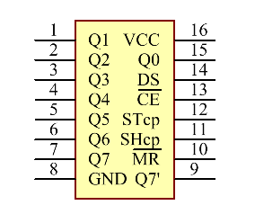
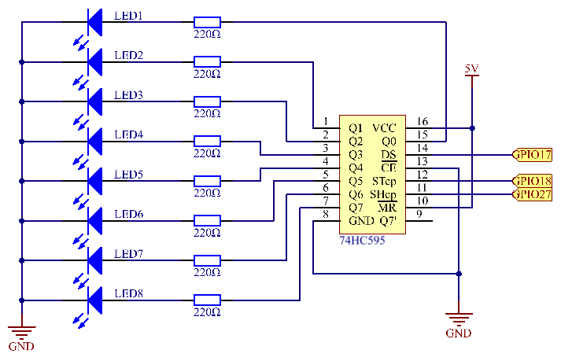
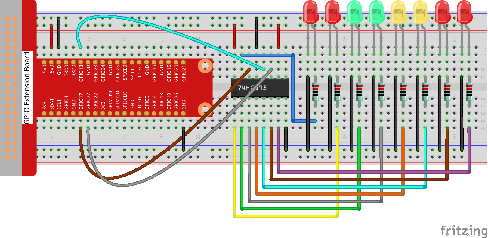
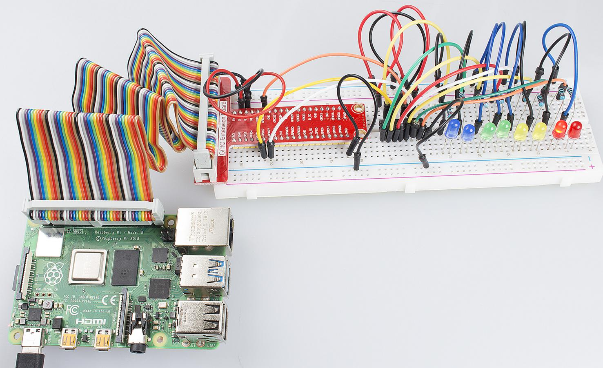

Lesson 10  Driving LEDs by 74HC595
=====================================

Introduction
----------------------

In this lesson, we will learn how to use 74HC595 to make eight LEDs
blink regularly.

Components
----------------------

\- 1 \* Raspberry Pi

\- 1 \* Breadboard

\- 1 \* 74HC595

\- 8 \* LED

\- 8 \* Resistor (220Ω)

\- Jumper wires

Principle
----------------------

**74HC595**

The 74HC595 consists of an 8−bit shift register and a storage register
with three−state parallel outputs. It converts serial input into
parallel output so that you can save IO ports of an MCU. The 74HC595 is
widely used to indicate multipath LEDs and drive multi-bit segment
displays. "Three-state" mentioned above refers to the fact that you can
set the output pins as either high, low or high impedance. With data
latching, the instant output will not be affected during the shifting;
with data output, you can cascade 74HC595s more easily. Compatible with
low voltage TTL circuit, 74HC595 can transform serial input of 8-bit
data into parallel output of 8-bit data. So it is often used to extend
GPIO for embedded system and drive low power devices.

**Pins of 74HC595 and their functions**:

**Q0-Q7**: 8-bit parallel data output pins, able to control 8 LEDs or 8
pins of 7-segment display directly.

**Q7’**: Series output pin, connected to DS of another 74HC595 to
connect multiple 74HC595s in series

**MR**: Reset pin, active at low level; here it is directly connected to
5V.

**SH_CP**: Time sequence input of shift register. On the rising edge,
the data in shift register moves successively one bit, i.e. data in Q1
moves to Q2, and so forth. While on the falling edge, the data in shift
register remain unchanged.

**ST_CP**: Time sequence input of storage register. On the rising edge,
data in the shift register moves into memory register.

**OE**: Output enable pin, active at low level, connected to GND.

**DS**: Serial data input pin

**VCC**: Positive supply voltage

**GND**: Ground

Schematic Diagram
----------------------

In this experiment, connect ST_CP to Raspberry Pi GPIO18, SH_CP to
GPIO27, and DS to GPIO17. Input data in DS pin to the shift register
when SH_CP (the clock input of the shift register) is at the rising
edge, and to the memory register when ST_CP (the clock input of the
memory) is at the rising edge. Then you can control the states of SH_CP
and ST_CP via Raspberry Pi GPIO to transform serial input data into
parallel output data so as to save Raspberry Pi GPIOs.

Experimental Procedures
-----------------------------

**Step 1:** Build the circuit.

For C Language Users:
^^^^^^^^^^^^^^^^^^^^^^^^^

**Step 2:** Change directory.

.. raw:: html

    <run></run>

.. code-block::

    cd /home/pi/Sunfounder_SuperKit_C_code_for_RaspberryPi/10_74HC595_LED/

**Step 3**: Compile.

.. raw:: html

    <run></run>

.. code-block::

    gcc 74HC595_LED.c -o 74HC595_LED -lwiringPi

**Step 4**: Run.

.. raw:: html

    <run></run>

.. code-block::

    sudo ./74HC595_LED

.. note::

    If it does not work after running, please refer to :ref:`C code is not working?`

**Code**

.. code-block:: c 

    #include <wiringPi.h>
    #include <stdio.h>
    
    #define   SDI   0   //serial data input
    #define   RCLK  1   //memory clock input(STCP)
    #define   SRCLK 2   //shift register clock input(SHCP)
    
    unsigned char LED[8] = {0x01,0x02,0x04,0x08,0x10,0x20,0x40,0x80};
    
    
    void pulse(int pin)
    {
        digitalWrite(pin, 0);
        digitalWrite(pin, 1);
    }
    
    void SIPO(unsigned char byte)
    {
        int i;
    
        for(i=0;i<8;i++){
            digitalWrite(SDI, ((byte & (0x80 >> i)) > 0));
            pulse(SRCLK);
        }
    }
    
    void init(void)
    {
        pinMode(SDI, OUTPUT); //make P0 output
        pinMode(RCLK, OUTPUT); //make P0 output
        pinMode(SRCLK, OUTPUT); //make P0 output
    
        digitalWrite(SDI, 0);
        digitalWrite(RCLK, 0);
        digitalWrite(SRCLK, 0);
    }
    
    int main(void)
    {
        int i;
    
        if(wiringPiSetup() == -1){ //when initialize wiring failed,print messageto screen
            printf("setup wiringPi failed !");
            return 1; 
        }
    
        init();
    
        while(1){
            for(i=0;i<8;i++){
                SIPO(LED[i]);
                pulse(RCLK);
                delay(150);
                //printf("i = %d\n",i);
            }
            delay(500);
    
            for(i=0;i<3;i++){
                SIPO(0xff);
                pulse(RCLK);
                delay(100);
                SIPO(0x00);
                pulse(RCLK);
                delay(100);
            }
            delay(500);
    //		digitalWrite(RCLK,0);
    
            for(i=0;i<8;i++){
                SIPO(LED[8-i-1]);
                pulse(RCLK);
                delay(150);
            }
            delay(500);
    
            for(i=0;i<3;i++){
                SIPO(0xff);
                pulse(RCLK);
                delay(100);
                SIPO(0x00);
                pulse(RCLK);
                delay(100);
            }
            delay(500);
        }
    
        return 0;
    }
    

For Python Users:
^^^^^^^^^^^^^^^^^^^^^

**Step 2:** Change directory.

.. raw:: html

    <run></run>
  
.. code-block::

    cd /home/pi/Sunfounder_SuperKit_Python_code_for_RaspberryPi/

**Step 3**: Run.

.. raw:: html

    <run></run>
  
.. code-block::

    sudo python3 10_74HC595_LED.py

Here you should see eight LEDs blink regularly.

**Code**    
    
.. raw:: html

    <run></run>
  
.. code-block:: python

    import RPi.GPIO as GPIO
    import time

    SDI   = 17
    RCLK  = 18
    SRCLK = 27

    #===============   LED Mode Defne ================
    #	You can define yourself, in binay, and convert it to Hex 
    #	8 bits a group, 0 means off, 1 means on
    #	like : 0101 0101, means LED1, 3, 5, 7 are on.(from left to right)
    #	and convert to 0x55.

    LED0 = [0x01,0x02,0x04,0x08,0x10,0x20,0x40,0x80]	#original mode
    LED1 = [0x01,0x03,0x07,0x0f,0x1f,0x3f,0x7f,0xff]	#blink mode 1
    LED2 = [0x01,0x05,0x15,0x55,0xb5,0xf5,0xfb,0xff]	#blink mode 2
    LED3 = [0x02,0x03,0x0b,0x0f,0x2f,0x3f,0xbf,0xff]	#blink mode 3
    #=================================================

    def print_msg():
        print ("Program is running...")
        print ("Please press Ctrl+C to end the program...")

    def setup():
        GPIO.setmode(GPIO.BCM)    # Number GPIOs by BCM
        GPIO.setup(SDI, GPIO.OUT)
        GPIO.setup(RCLK, GPIO.OUT)
        GPIO.setup(SRCLK, GPIO.OUT)
        GPIO.output(SDI, GPIO.LOW)
        GPIO.output(RCLK, GPIO.LOW)
        GPIO.output(SRCLK, GPIO.LOW)

    def hc595_in(dat):
        for bit in range(0, 8):	
            GPIO.output(SDI, 0x80 & (dat << bit))
            GPIO.output(SRCLK, GPIO.HIGH)
            time.sleep(0.001)
            GPIO.output(SRCLK, GPIO.LOW)

    def hc595_out():
        GPIO.output(RCLK, GPIO.HIGH)
        time.sleep(0.001)
        GPIO.output(RCLK, GPIO.LOW)

    def loop():
        WhichLeds = LED0	# Change Mode, modes from LED0 to LED3
        sleeptime = 0.1		# Change speed, lower value, faster speed
        while True:
            for i in range(0, len(WhichLeds)):
                hc595_in(WhichLeds[i])
                hc595_out()
                time.sleep(sleeptime)
            
            for i in range(len(WhichLeds)-1, -1, -1):
                hc595_in(WhichLeds[i])
                hc595_out()
                time.sleep(sleeptime)

    def destroy():   # When program ending, the function is executed. 
        GPIO.cleanup()

    if __name__ == '__main__': # Program starting from here 
        print_msg()
        setup() 
        try:
            loop()  
        except KeyboardInterrupt:  
            destroy()  

Further Exploration
----------------------

In this experiment, three Raspberry Pi GPIOs are used to separately
control 8 LEDs based on 74HC595. In fact, 74HC595 has another powerful
function – cascade. With cascade, you can use a microprocessor to
control more peripherals. We'll check more details later.
