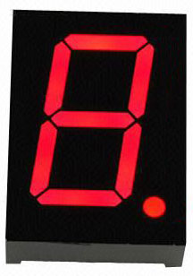
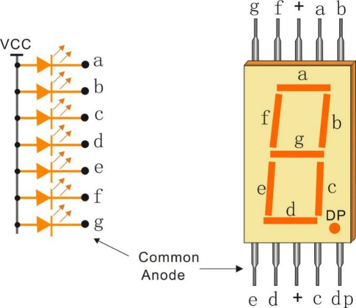
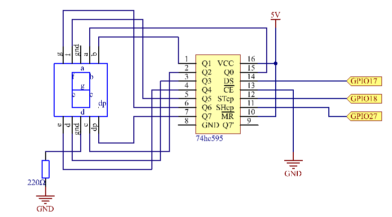
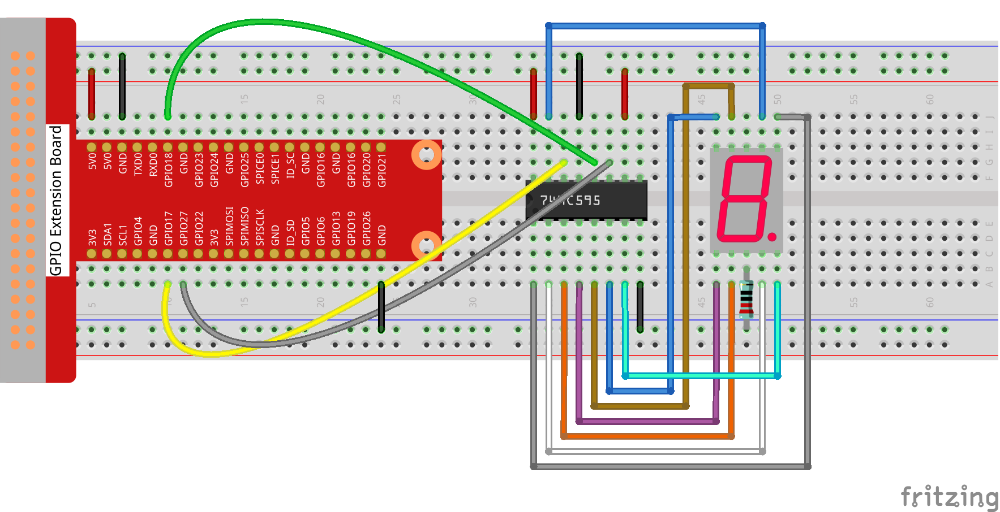
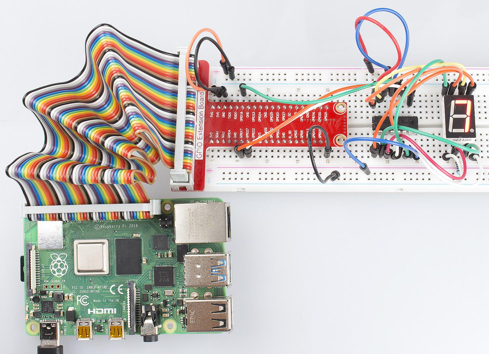
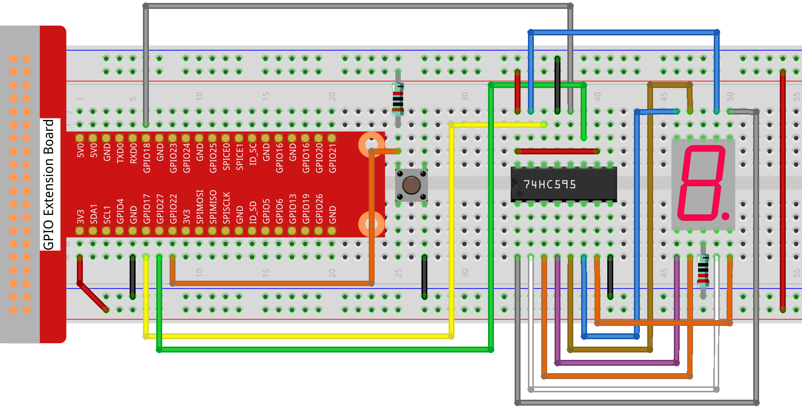
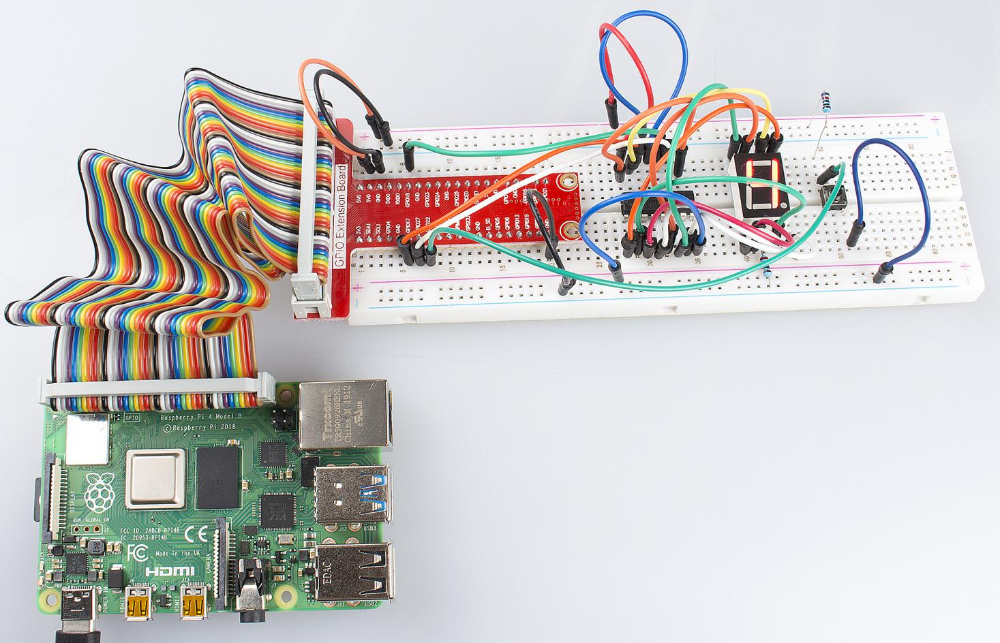

Lesson 11  Driving 7-Segment Display by 74HC595
==================================================

Introduction
--------------------

Since we've got some knowledge of the 74HC595 in the previous lesson,
now let's try to use it and drive a 7-segment display to show a figure
from 0 to 9.

Components
--------------------

\- 1 \* Raspberry Pi

\- 1 \* Breadboard

\- 1 \* 74HC595

\- 1 \* 7-segment display

\- 2 \* Resistor (220KΩ,10K)

\- 1 \* Button

\- Jumper wires

Principle
--------------------

**7-Segment Display**

A 7-segment display is an 8-shaped component which packages 7 LEDs. Each
LED is called a segment – when energized, one segment forms part of a
numeral (both decimal and hexadecimal) to be displayed. An additional
8th LED is sometimes used within the same package thus allowing the
indication of a decimal point (DP) when two or more 7-segment displays
are connected together to display numbers greater than ten.

Each of the LEDs in the display is given a positional segment with one
of its connection pins led out from the rectangular plastic package.
These LED pins are labeled from \"a\" through to \"g\" representing each
individual LED. The other LED pins are connected together forming a
common pin. So by forward biasing the appropriate pins of the LED
segments in a particular order, some segments will brighten and others
stay dim, thus showing the corresponding character on the display.

The common pin of the display generally tells its type. There are two
types of pin connection: a pin of connected cathodes and one of
connected anodes, indicating Common Cathode (CC) and Common Anode (CA).
As the name suggests, a CC display has all the cathodes of the 7 LEDs
connected when a CA display has all the anodes of the 7 segments
connected.

**Common Cathode 7-Segment Display**

In a common cathode display, the cathodes of all the LED segments are
connected to the logic \"0\" or ground. Then an individual segment (a-g)
is energized by a \"HIGH\", or logic \"1\" signal via a current limiting
resistor to forward bias the anode of the segment.

.. image:: media/image137.png
    :align: center

**Common Anode 7-Segment Display**

In a common anode display, the anodes of all the LED segments are
connected to the logic \"1\". Then an individual segment (a-g) is
energized by a ground, logic \"0\" or \"LOW\" signal via a current limiting
resistor to the cathode of the segment.

In this experiment, a common cathode 7-segment display is use. It should
be connected to ground. When the anode of an LED in a certain segment is
at high level, the corresponding segment will light up; when it is at
low, the segment will stay dim.

Schematic Diagram
---------------------

Connect pin ST_CP of 74HC595 to Raspberry Pi GPIO18, SH_CP to GPIO27, DS
to GPIO17, parallel output ports to 8 segments of the LED segment
display. Input data in DS pin to shift register when SH_CP (the clock
input of the shift register) is at the rising edge, and to the memory
register when ST_CP (the clock input of the memory) is at the rising
edge. Then you can control the states of SH_CP and ST_CP via the
Raspberry Pi GPIOs to transform serial data input into parallel data
output so as to save Raspberry Pi GPIOs and drive the display.

Experimental Procedures
---------------------------

**Step 1:** Build the circuit.

For C Language Users:
^^^^^^^^^^^^^^^^^^^^^^^^^

**Step 2:** Change directory.

.. code-block::

    cd/home/pi/Sunfounder_SuperKit_C_code_for_RaspberryPi/11_Segment/

**Step 3**: Compile.

.. code-block::

    gcc segment1.c -o segment1 -lwiringPi

**Step 4**: Run.

.. code-block::

    sudo ./segment1

For Python Users:
^^^^^^^^^^^^^^^^^^^^^^^

**Step 2:** Change directory.

.. code-block::

    cd/home/pi/Sunfounder_SuperKit_Python_code_for_RaspberryPi/

**Step 3**: Run.

.. code-block::

    sudo python3 11_segment.py

You should see the 7-segment display from 0 to 9, and A to F.

Further Exploration
-----------------------

You can slightly modify the hardware and software based on this
experiment to make a dice. For hardware, add a button to the original
board.

Build the circuit:
-----------------------

**Next**, go to *11_Segment*, and compile *dice.c*

.. code-block::

    cd/home/pi/Sunfounder_SuperKit_C_code_for_RaspberryPi/11_Segment/

    gcc dice.c -lwiringPi

Run.

.. code-block::

    sudo ./a.out

Now you should see a number flashing between 0 and 6 quickly on the
segment display. Press the button on the breadboard, and the display
will statically display a random number between 0 and 6 for 2 seconds
and then circularly flash randomly between 0 and 6 again.

Summary
--------------

Through this lesson, you may have mastered the basic principle and
programming for 7-segment display based on Raspberry Pi, as well as more
knowledge about using 74HC595. Now you can apply what you’ve learnt and
put it into practice to create your own works!
