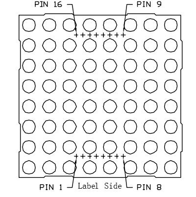
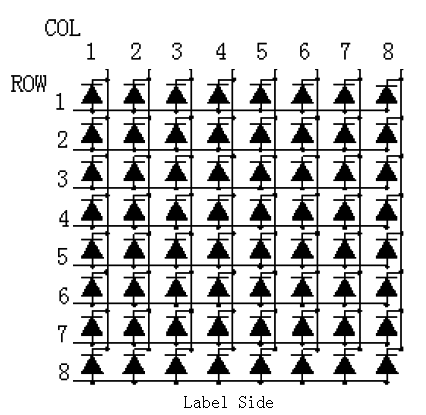
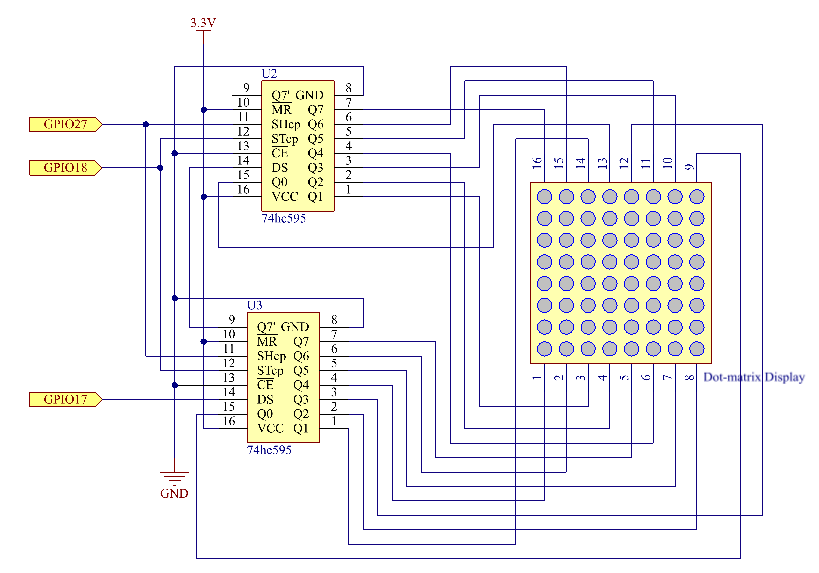
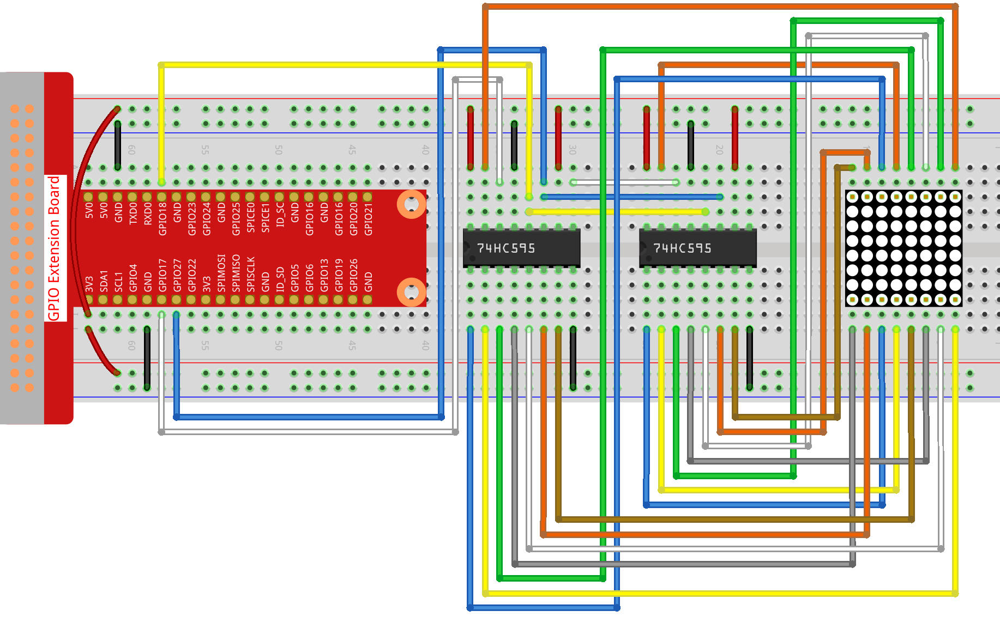
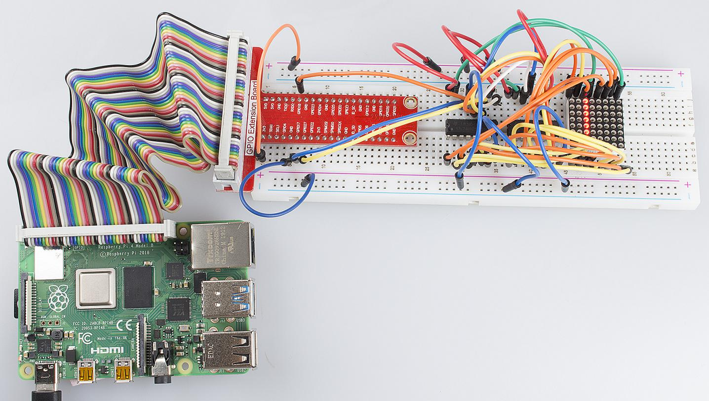

Lesson 12  Driving Dot-Matrix by 74HC595
============================================

Introduction
-----------------

With low-voltage scanning, dot matrix LED displays have advantages such
as power saving, long service life, low cost, high brightness, a wide
angle of view, long visual range, waterproofness, and so on. They can
meet the needs of different applications and thus have a broad
development prospect. In this lesson, we will learn how to use 74HC595
to drive an LED dot-matrix.

Components
-----------------

\- 1 \* Raspberry Pi

\- 1 \* Breadboard

\- 2 \* 74HC595

\- 1 \* Dot-Matrix

\- Jumper wires

Principle
-----------------

**Dot Matrix**

The external view:

Pin definition:

Define the row and column numbering at first (only for the dot matrix
whose model number ends with BS)

Pin numbering corresponding to the above rows and columns:

+-------------+--------+--------+-------+--------+-------+--------+--------+--------+
| **COL**     | **1**  | **2**  | **3** | **4**  | **5** | **6**  | **7**  | **8**  |
+-------------+--------+--------+-------+--------+-------+--------+--------+--------+
| **Pin No.** | **13** | **3**  | **4** | **10** | **6** | **11** | **15** | **16** |
+-------------+--------+--------+-------+--------+-------+--------+--------+--------+
| **ROW**     | **1**  | **2**  | **3** | **4**  | **5** | **6**  | **7**  | **8**  |
+-------------+--------+--------+-------+--------+-------+--------+--------+--------+
| **Pin No.** | **9**  | **14** | **8** | **12** | **1** | **7**  | **2**  | **5**  |
+-------------+--------+--------+-------+--------+-------+--------+--------+--------+

The 8*8 dot matrix is made up of sixty-four LEDs and each LED is placed
at the cross point of a row and a column. When the electrical level of a
certain row is High and the electrical level of a certain column is Low,
the corresponding LED at their cross point will light up. For example,
to turn on the LED at the first dot, you should set ROW 1 to high level
and COL 1 to low, so the LED at the first dot brightens; to turn on all
the LEDs on the first row, set ROW 1 to high level and COL 1-8 to low,
and then all the LEDs on the first row will light up; similarly, set COL
1 to low level and ROW 1-8 to high level, and all the LEDs on the first
column will light up.

The principle of 74HC595 has been illustrated previously. One chip is
used to control the rows of the dot matrix while the other, the columns.

Schematic Diagram
----------------------

Experimental Procedures
------------------------------

**Step 1:** Build the circuit.

For C Language Users:
^^^^^^^^^^^^^^^^^^^^^^^^

**Step 2:** Change directory.

.. code-block::

    cd/home/pi/Sunfounder_SuperKit_C_code_for_RaspberryPi/12_DotMatrix/

**Step 3**: Compile.

.. code-block::

    gcc dotMatrix.c -o dotMatrix -lwiringPi

**Step 4**: Run.

.. code-block::

    sudo ./dotMatrix

**Code**

.. code-block:: c 

    #include <wiringPi.h>
    #include <stdio.h>
    
    #define   SDI   0   //serial data input
    #define   RCLK  1   //memory clock input(STCP)
    #define   SRCLK 2   //shift register clock input(SHCP)
    
    unsigned char code_H[20] = {0x01,0xff,0x80,0xff,0x01,0x02,0x04,0x08,0x10,0x20,0x40,0x80,0xff,0xff,0xff,0xff,0xff,0xff,0xff,0xff};
    unsigned char code_L[20] = {0x00,0x7f,0x00,0xfe,0x00,0x00,0x00,0x00,0x00,0x00,0x00,0x00,0xfe,0xfd,0xfb,0xf7,0xef,0xdf,0xbf,0x7f};
    
    //unsigned char code_L[8] = {0x00,0x00,0x3c,0x42,0x42,0x3c,0x00,0x00};
    //unsigned char code_H[8] = {0xff,0xe7,0xdb,0xdb,0xdb,0xdb,0xe7,0xff};
    
    //unsigned char code_L[8] = {0xff,0xff,0xc3,0xbd,0xbd,0xc3,0xff,0xff};
    //unsigned char code_H[8] = {0x00,0x18,0x24,0x24,0x24,0x24,0x18,0x00};
    
    void init(void)
    {
        pinMode(SDI, OUTPUT); //make P0 output
        pinMode(RCLK, OUTPUT); //make P0 output
        pinMode(SRCLK, OUTPUT); //make P0 output
    
        digitalWrite(SDI, 0);
        digitalWrite(RCLK, 0);
        digitalWrite(SRCLK, 0);
    }
    
    void hc595_in(unsigned char dat)
    {
        int i;
    
        for(i=0;i<8;i++){
            digitalWrite(SDI, 0x80 & (dat << i));
            digitalWrite(SRCLK, 1);
            delay(1);
            digitalWrite(SRCLK, 0);
        }
    }
    
    void hc595_out()
    {
        digitalWrite(RCLK, 1);
        delay(1);
        digitalWrite(RCLK, 0);
    }
    
    int main(void)
    {
        int i;
    
        if(wiringPiSetup() == -1){ //when initialize wiring failed,print messageto screen
            printf("setup wiringPi failed !");
            return 1; 
        }
    
        init();
    
        while(1){
            for(i=0;i<sizeof(code_H);i++){
                hc595_in(code_L[i]);
                hc595_in(code_H[i]);
                hc595_out();
                delay(100);
            }
    
            for(i=sizeof(code_H);i>=0;i--){
                hc595_in(code_L[i]);
                hc595_in(code_H[i]);
                hc595_out();
                delay(100);
            }
        }
    
        return 0;
    }

For Python Users:
^^^^^^^^^^^^^^^^^^^^^^

**Step 2:** Change directory.

.. code-block::

    cd/home/pi/Sunfounder_SuperKit_Python_code_for_RaspberryPi/

**Step 3**: Run.

.. code-block::

    sudo python3 12_DotMatrix.py

You should see LEDs light up as you control.

**Code**    
    
.. code-block:: python

    import RPi.GPIO as GPIO
    import time

    SDI   = 17
    RCLK  = 18
    SRCLK = 27

    code_H = [0x01,0xff,0x80,0xff,0x01,0x02,0x04,0x08,0x10,0x20,0x40,0x80,0xff,0xff,0xff,0xff,0xff,0xff,0xff,0xff]
    code_L = [0x00,0x7f,0x00,0xfe,0x00,0x00,0x00,0x00,0x00,0x00,0x00,0x00,0xfe,0xfd,0xfb,0xf7,0xef,0xdf,0xbf,0x7f]

    def print_msg():
        print ("Program is running...")
        print ("Please press Ctrl+C to end the program...")

    def setup():
        GPIO.setmode(GPIO.BCM)    # Number GPIOs by BCM
        GPIO.setup(SDI, GPIO.OUT)
        GPIO.setup(RCLK, GPIO.OUT)
        GPIO.setup(SRCLK, GPIO.OUT)
        GPIO.output(SDI, GPIO.LOW)
        GPIO.output(RCLK, GPIO.LOW)
        GPIO.output(SRCLK, GPIO.LOW)

    def hc595_in(dat):
        for bit in range(0, 8):	
            GPIO.output(SDI, 0x80 & (dat << bit))
            GPIO.output(SRCLK, GPIO.HIGH)
            time.sleep(0.001)
            GPIO.output(SRCLK, GPIO.LOW)

    def hc595_out():
        GPIO.output(RCLK, GPIO.HIGH)
        time.sleep(0.001)
        GPIO.output(RCLK, GPIO.LOW)

    def loop():
        while True:
            for i in range(0, len(code_H)):
                hc595_in(code_L[i])
                hc595_in(code_H[i])
                hc595_out()
                time.sleep(0.1)

            for i in range(len(code_H)-1, -1, -1):
                hc595_in(code_L[i])
                hc595_in(code_H[i])
                hc595_out()
                time.sleep(0.1)

    def destroy():   # When program ending, the function is executed. 
        GPIO.cleanup()

    if __name__ == '__main__':   # Program starting from here 
        print_msg()
        setup() 
        try:
            loop()  
        except KeyboardInterrupt:  
            destroy() 

Summary
----------
Through this lesson, you have got the basic principle of LED dot matrix
and how to program the Raspberry Pi to drive an LED dot matrix based on
74HC595 cascade. With the knowledge learnt, try more fascinating
creations!

