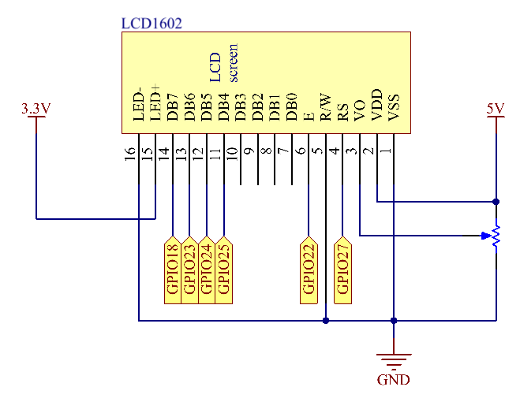
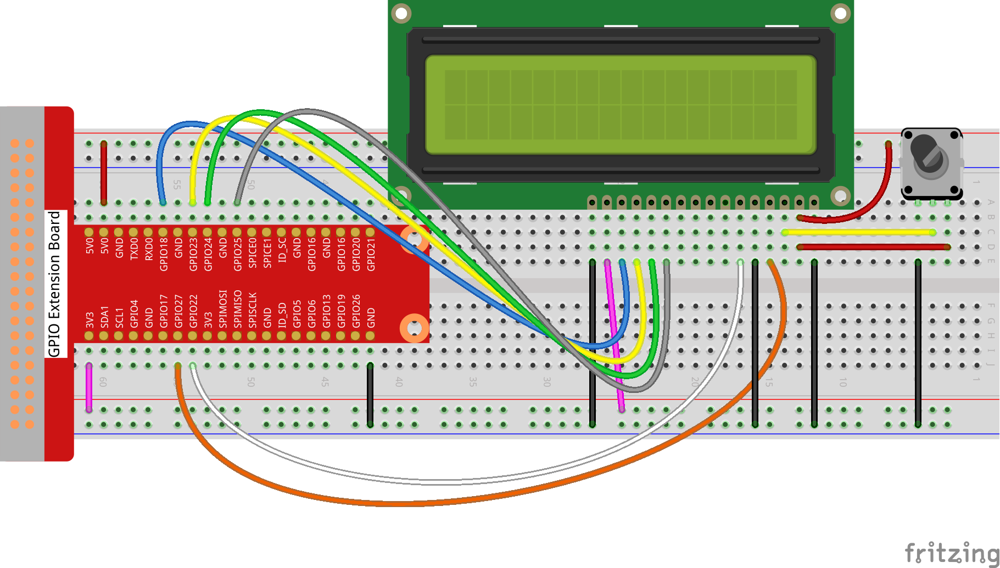
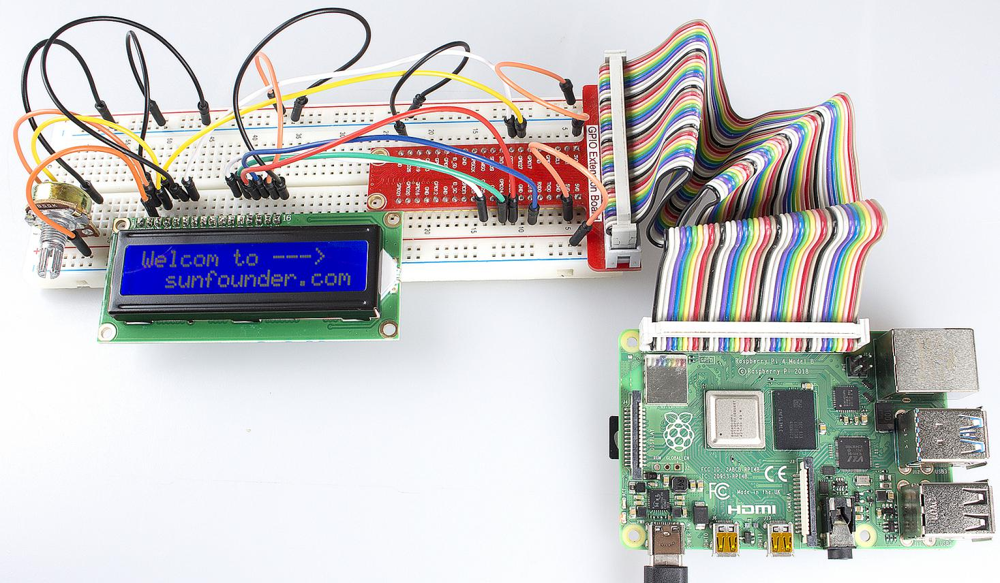

Lesson 13  LCD1602
=====================

Introduction
---------------

In this lesson, we will learn how to use LCD1602 to display characters
and strings.

Components
---------------

\- 1 \* Raspberry Pi

\- 1 \* Breadboard

\- 1 \* LCD1602

\- 1 \* Potentiometer

\- Jumper wires

Principle
---------------

LCD1602, or character type LCD1602, is a dot matrix LCD module specially
used to display letters, figures, symbols, and so on. It consists of
many 16*2 dot matrixes, and each one is composed of 5*7 or 5*11
character bit. Each character bit can display one character. There is a
dot space between each adjacent character bit. Also there is a dot space
between each row. The dot space functions as a character space or line
space; thus, LCD1602 cannot display graphics very well. It is widely
used in pocket instruments and low power application systems due to its
micro power consumption, small size, richness in contents,
ultra-thinness and lightness.

LCD1602 uses the standard 16-pin port, among which:

**Pin 1 (GND):** connected to Ground

**Pin 2 (Vcc):** connected to 5V power supply

**Pin 3 (Vo):** used to adjust the contrast of LCD1602; the level is
lowest when it’s connected to a positive power supply, and highest when
connected to ground (you can connect a 10K potentiometer to adjust its
contrast when using LCD1602)

**Pin 4 (RS):** register select pin that controls where in the LCD’s
memory you are writing data to. You can select either the data register,
which holds what goes on the screen, or an instruction register, which
is where the LCD’s controller looks for instructions on what to do next.

**Pin 5 (R/W):** to read/write signals; it reads signals when supplied
with high level (1), and writes when low level (0) (in this experiment,
you only need to write data to LCD1602, so just connect this pin to
ground)

**Pin 6 (E):** An enable pin that, when low-level energy is supplied,
causes the LCD module to execute relevant instructions

**Pin 7 (D0-D7):** pins that read and write data

**A and K:** controlling LCD backlight

LCD1602 has two operation modes: 4-bit and 8-bit. When the IOs of
microprocessor (MCU) are insufficient, you can choose 4-bit mode, under
which only pins D4~D7 are used. After connecting the circuit, you can
operate LCD1602 by Raspberry Pi.

Schematic Diagram
------------------

Experimental Procedures
-----------------------------

**Step1:** Build the circuit (please be sure the pins are connected
correctly. Otherwise, characters will not be displayed properly):

For C Language Users:
^^^^^^^^^^^^^^^^^^^^^^

**Step 2:** Change directory.

.. code-block::

    cd/home/pi/Sunfounder_SuperKit_C_code_for_RaspberryPi/13_LCD1602/

**Step 3:** Compile.

.. code-block::

    gcc lcd1602_2.c -o lcd1602_2 -lwiringPiDev -lwiringPi

**Step 4:** Run.

.. code-block::

    sudo ./lcd1602_2

**Code**

.. code-block:: c 

    #include <stdio.h>
    #include <stdlib.h>
    #include <wiringPi.h>
    #include <lcd.h>
    
    const unsigned char Buf[] = "---SUNFOUNDER---";
    const unsigned char myBuf[] = "  sunfounder.com";
    
    int main(void)
    {
        int fd;
        int i;
        if (wiringPiSetup() == -1){
            exit(1);
        }
    
        fd = lcdInit(2,16,4, 2,3, 6,5,4,1,0,0,0,0); //see /usr/local/include/lcd.h
        printf("%d", fd);
        if (fd == -1){
            printf("lcdInit 1 failed\n") ;
            return 1;
        }
        delay(1000);
    
        lcdClear(fd);
        lcdPosition(fd, 0, 0); 
        lcdPuts(fd, "Welcom To--->");
    
        lcdPosition(fd, 0, 1); 
        lcdPuts(fd, "  sunfounder.com");
    
        delay(1000);
        lcdClear(fd);
    
        while(1){
            for(i=0;i<sizeof(Buf)-1;i++){
                lcdPosition(fd, i, 1);
                lcdPutchar(fd, *(Buf+i));
                delay(200);
            }
            lcdPosition(fd, 0, 1); 
            lcdClear(fd);
            delay(500);
            for(i=0; i<16; i++){
                lcdPosition(fd, i, 0);
                lcdPutchar(fd, *(myBuf+i));
                delay(100);
            }
        }
    
        return 0;
    }

For Python Users:
^^^^^^^^^^^^^^^^^^^^^

**Step 2:** Change directory.

.. code-block::

    cd/home/pi/Sunfounder_SuperKit_Python_code_for_RaspberryPi/

**Step 3:** Run.

.. code-block::

    sudo python3 13_lcd1602.py

You should see two lines of characters displayed on the LCD1602:
\"**SUNFOUNDER**\" and \"**Hello World ! :)**\".

**Code**    
    
.. code-block:: python

    from time import sleep

    class LCD:
        # commands
        LCD_CLEARDISPLAY        = 0x01
        LCD_RETURNHOME          = 0x02
        LCD_ENTRYMODESET        = 0x04
        LCD_DISPLAYCONTROL      = 0x08
        LCD_CURSORSHIFT         = 0x10
        LCD_FUNCTIONSET         = 0x20
        LCD_SETCGRAMADDR        = 0x40
        LCD_SETDDRAMADDR        = 0x80

        # flags for display entry mode
        LCD_ENTRYRIGHT      = 0x00
        LCD_ENTRYLEFT       = 0x02
        LCD_ENTRYSHIFTINCREMENT     = 0x01
        LCD_ENTRYSHIFTDECREMENT     = 0x00

        # flags for display on/off control
        LCD_DISPLAYON       = 0x04
        LCD_DISPLAYOFF      = 0x00
        LCD_CURSORON        = 0x02
        LCD_CURSOROFF       = 0x00
        LCD_BLINKON         = 0x01
        LCD_BLINKOFF        = 0x00

        # flags for display/cursor shift
        LCD_DISPLAYMOVE     = 0x08
        LCD_CURSORMOVE      = 0x00

        # flags for display/cursor shift
        LCD_DISPLAYMOVE     = 0x08
        LCD_CURSORMOVE      = 0x00
        LCD_MOVERIGHT       = 0x04
        LCD_MOVELEFT        = 0x00

        # flags for function set
        LCD_8BITMODE        = 0x10
        LCD_4BITMODE        = 0x00
        LCD_2LINE           = 0x08
        LCD_1LINE           = 0x00
        LCD_5x10DOTS        = 0x04
        LCD_5x8DOTS         = 0x00

        def __init__(self, pin_rs=27, pin_e=22, pins_db=[25, 24, 23, 18], GPIO = None):
            # Emulate the old behavior of using RPi.GPIO if we haven't been given
            # an explicit GPIO interface to use
            if not GPIO:
                import RPi.GPIO as GPIO
                self.GPIO = GPIO
                self.pin_rs = pin_rs
                self.pin_e = pin_e
                self.pins_db = pins_db

                self.used_gpio = self.pins_db[:]
                self.used_gpio.append(pin_e)
                self.used_gpio.append(pin_rs)

                self.GPIO.setwarnings(False)
                self.GPIO.setmode(GPIO.BCM)
                self.GPIO.setup(self.pin_e, GPIO.OUT)
                self.GPIO.setup(self.pin_rs, GPIO.OUT)

                for pin in self.pins_db:
                    self.GPIO.setup(pin, GPIO.OUT)

            self.write4bits(0x33) # initialization
            self.write4bits(0x32) # initialization
            self.write4bits(0x28) # 2 line 5x7 matrix
            self.write4bits(0x0C) # turn cursor off 0x0E to enable cursor
            self.write4bits(0x06) # shift cursor right

            self.displaycontrol = self.LCD_DISPLAYON | self.LCD_CURSOROFF | self.LCD_BLINKOFF

            self.displayfunction = self.LCD_4BITMODE | self.LCD_1LINE | self.LCD_5x8DOTS
            self.displayfunction |= self.LCD_2LINE

            """ Initialize to default text direction (for romance languages) """
            self.displaymode =  self.LCD_ENTRYLEFT | self.LCD_ENTRYSHIFTDECREMENT
            self.write4bits(self.LCD_ENTRYMODESET | self.displaymode) #  set the entry mode

            self.clear()

        def begin(self, cols, lines):
            if (lines > 1):
                self.numlines = lines
                self.displayfunction |= self.LCD_2LINE
                self.currline = 0

        def home(self):
            self.write4bits(self.LCD_RETURNHOME) # set cursor position to zero
            self.delayMicroseconds(3000) # this command takes a long time!
        
        def clear(self):
            self.write4bits(self.LCD_CLEARDISPLAY) # command to clear display
            self.delayMicroseconds(3000)    # 3000 microsecond sleep, clearing the display takes a long time

        def setCursor(self, col, row):
            self.row_offsets = [ 0x00, 0x40, 0x14, 0x54 ]

            if ( row > self.numlines ): 
                row = self.numlines - 1 # we count rows starting w/0

            self.write4bits(self.LCD_SETDDRAMADDR | (col + self.row_offsets[row]))

        def noDisplay(self): 
            # Turn the display off (quickly)
            self.displaycontrol &= ~self.LCD_DISPLAYON
            self.write4bits(self.LCD_DISPLAYCONTROL | self.displaycontrol)

        def display(self):
            # Turn the display on (quickly)
            self.displaycontrol |= self.LCD_DISPLAYON
            self.write4bits(self.LCD_DISPLAYCONTROL | self.displaycontrol)

        def noCursor(self):
            # Turns the underline cursor on/off
            self.displaycontrol &= ~self.LCD_CURSORON
            self.write4bits(self.LCD_DISPLAYCONTROL | self.displaycontrol)

        def cursor(self):
            # Cursor On
            self.displaycontrol |= self.LCD_CURSORON
            self.write4bits(self.LCD_DISPLAYCONTROL | self.displaycontrol)

        def noBlink(self):
            # Turn on and off the blinking cursor
            self.displaycontrol &= ~self.LCD_BLINKON
            self.write4bits(self.LCD_DISPLAYCONTROL | self.displaycontrol)

        def noBlink(self):
            # Turn on and off the blinking cursor
            self.displaycontrol &= ~self.LCD_BLINKON
            self.write4bits(self.LCD_DISPLAYCONTROL | self.displaycontrol)

        def scrollDisplayLeft(self):
            # These commands scroll the display without changing the RAM
            self.write4bits(self.LCD_CURSORSHIFT | self.LCD_DISPLAYMOVE | self.LCD_MOVELEFT)

        def scrollDisplayRight(self):
            # These commands scroll the display without changing the RAM
            self.write4bits(self.LCD_CURSORSHIFT | self.LCD_DISPLAYMOVE | self.LCD_MOVERIGHT);

        def leftToRight(self):
            # This is for text that flows Left to Right
            self.displaymode |= self.LCD_ENTRYLEFT
            self.write4bits(self.LCD_ENTRYMODESET | self.displaymode);

        def rightToLeft(self):
            # This is for text that flows Right to Left
            self.displaymode &= ~self.LCD_ENTRYLEFT
            self.write4bits(self.LCD_ENTRYMODESET | self.displaymode)

        def autoscroll(self):
            # This will 'right justify' text from the cursor
            self.displaymode |= self.LCD_ENTRYSHIFTINCREMENT
            self.write4bits(self.LCD_ENTRYMODESET | self.displaymode)

        def noAutoscroll(self): 
            # This will 'left justify' text from the cursor
            self.displaymode &= ~self.LCD_ENTRYSHIFTINCREMENT
            self.write4bits(self.LCD_ENTRYMODESET | self.displaymode)

        def write4bits(self, bits, char_mode=False):
            # Send command to LCD
            self.delayMicroseconds(1000) # 1000 microsecond sleep
            bits=bin(bits)[2:].zfill(8)
            self.GPIO.output(self.pin_rs, char_mode)
            for pin in self.pins_db:
                self.GPIO.output(pin, False)
            for i in range(4):
                if bits[i] == "1":
                    self.GPIO.output(self.pins_db[::-1][i], True)
            self.pulseEnable()
            for pin in self.pins_db:
                self.GPIO.output(pin, False)
            for i in range(4,8):
                if bits[i] == "1":
                    self.GPIO.output(self.pins_db[::-1][i-4], True)
            self.pulseEnable()

        def delayMicroseconds(self, microseconds):
            seconds = microseconds / float(1000000) # divide microseconds by 1 million for seconds
            sleep(seconds)

        def pulseEnable(self):
            self.GPIO.output(self.pin_e, False)
            self.delayMicroseconds(1)       # 1 microsecond pause - enable pulse must be > 450ns 
            self.GPIO.output(self.pin_e, True)
            self.delayMicroseconds(1)       # 1 microsecond pause - enable pulse must be > 450ns 
            self.GPIO.output(self.pin_e, False)
            self.delayMicroseconds(1)       # commands need > 37us to settle

        def message(self, text):
            # Send string to LCD. Newline wraps to second line
            print ("message: %s"%text)
            for char in text:
                if char == '\n':
                    self.write4bits(0xC0) # next line
                else:
                    self.write4bits(ord(char),True)
        
        def destroy(self):
            #print ("clean up used_gpio")
            self.GPIO.cleanup(self.used_gpio)

    def loop():
        global lcd
        lcd = LCD()
        while True:
            lcd.clear()
            lcd.message(" LCD 1602 Test \n123456789ABCDEF")
            sleep(2)
            lcd.clear()
            lcd.message("   SUNFOUNDER \nHello World ! :)")
            sleep(2)
            lcd.clear()
            lcd.message("Welcom to --->\n  sunfounder.com")
            sleep(2)

    def destroy():
        lcd.destroy()

    if __name__ == '__main__':
        try:
            loop()
        except KeyboardInterrupt:
            destroy()

Further Exploration
-----------------------

In this experiment, the LCD1602 is driven in the 4-bit mode. You can try
programming by yourself to drive it in the 8-bit mode.
