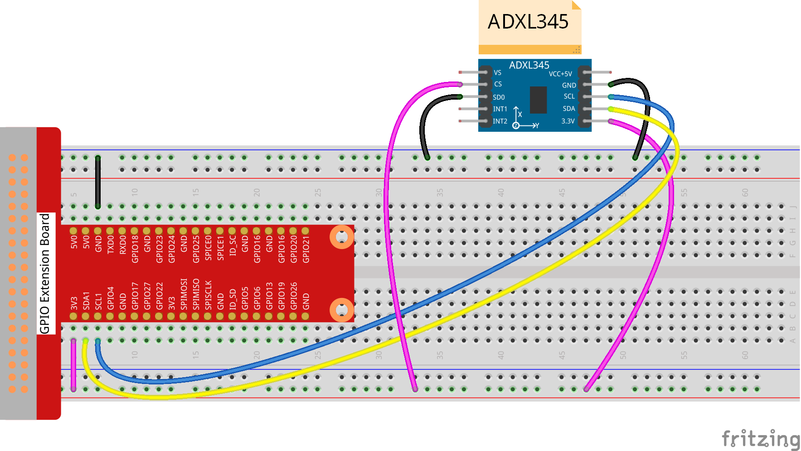

Lesson 14  ADXL345
======================

Introduction
--------------------------

In this lesson, we will learn how to use the acceleration sensor
ADXL345.

Components
--------------------------

\- 1 \* Raspberry Pi

\- 1 \* Breadboard

\- 1 \* ADXL345 module

\- Jumper wires

Principle
--------------------------

**ADXL345**

The ADXL345 is a small, thin, low power, 3-axis accelerometer with high
resolution (13-bit) measurement at up to ±16 g. Digital output data is
formatted as 16-bit two’s complement and is accessible through either an
SPI (3- or 4-wire) or I2C digital interface.

The ADXL345 is well suited to measure the static acceleration of gravity
in tilt-sensing applications, as well as dynamic acceleration resulting
from motion or shock. Its high resolution (4 mg/LSB) enables the
inclination change measurement by less than 1.0°. And the excellent
sensitivity (3.9mg/LSB @2g) provides a high-precision output of up to
±16g. In this experiment, I2C digital interface is used.

Experimental Procedures
--------------------------

**Step 1:** Build the circuit.

The I2C interface is used in the following program. Before running the
program, please make sure the I2C driver module of Raspberry Pi has
loaded normally(Refer to Appendix).

For C Language Users:
^^^^^^^^^^^^^^^^^^^^^^^

**Step 2:** Change directory.

.. code-block::

    cd/home/pi/Sunfounder_SuperKit_C_code_for_RaspberryPi/14_ADXL345/

**Step 3:** Compile.

.. code-block::

    gcc adxl345.c -o adxl345 -lwiringPi

**Step 4:** Run.

.. code-block::

    sudo ./adxl345

**Code**

.. code-block:: c 

    #include <wiringPiI2C.h>
    #include <stdio.h>
    #include <stdlib.h>
    #include <errno.h>
    
    #define  DevAddr  0x53  //device address
    
    struct acc_dat{
        int x;
        int y;
        int z;
    };
    
    void adxl345_init(int fd)
    {
        wiringPiI2CWriteReg8(fd, 0x31, 0x0b);
        wiringPiI2CWriteReg8(fd, 0x2d, 0x08);
    //	wiringPiI2CWriteReg8(fd, 0x2e, 0x00);
        wiringPiI2CWriteReg8(fd, 0x1e, 0x00);
        wiringPiI2CWriteReg8(fd, 0x1f, 0x00);
        wiringPiI2CWriteReg8(fd, 0x20, 0x00);
        
        wiringPiI2CWriteReg8(fd, 0x21, 0x00);
        wiringPiI2CWriteReg8(fd, 0x22, 0x00);
        wiringPiI2CWriteReg8(fd, 0x23, 0x00);
    
        wiringPiI2CWriteReg8(fd, 0x24, 0x01);
        wiringPiI2CWriteReg8(fd, 0x25, 0x0f);
        wiringPiI2CWriteReg8(fd, 0x26, 0x2b);
        wiringPiI2CWriteReg8(fd, 0x27, 0x00);
        
        wiringPiI2CWriteReg8(fd, 0x28, 0x09);
        wiringPiI2CWriteReg8(fd, 0x29, 0xff);
        wiringPiI2CWriteReg8(fd, 0x2a, 0x80);
        wiringPiI2CWriteReg8(fd, 0x2c, 0x0a);
        wiringPiI2CWriteReg8(fd, 0x2f, 0x00);
        wiringPiI2CWriteReg8(fd, 0x38, 0x9f);
    }
    
    struct acc_dat adxl345_read_xyz(int fd)
    {
        char x0, y0, z0, x1, y1, z1;
        struct acc_dat acc_xyz;
    
        x0 = 0xff - wiringPiI2CReadReg8(fd, 0x32);
        x1 = 0xff - wiringPiI2CReadReg8(fd, 0x33);
        y0 = 0xff - wiringPiI2CReadReg8(fd, 0x34);
        y1 = 0xff - wiringPiI2CReadReg8(fd, 0x35);
        z0 = 0xff - wiringPiI2CReadReg8(fd, 0x36);
        z1 = 0xff - wiringPiI2CReadReg8(fd, 0x37);
    
        printf("  x0 = %d   ",x0);printf("x1 = %d  \n",x1);
        printf("  y0 = %d   ",y0);printf("y1 = %d  \n",y1);
        printf("  z0 = %d   ",z0);printf("z1 = %d  \n",z1);
    
        acc_xyz.x = (int)(x1 << 8) + (int)x0;
        acc_xyz.y = (int)(y1 << 8) + (int)y0;
        acc_xyz.z = (int)(z1 << 8) + (int)z0;
    
        if(acc_xyz.x > 32767){
            acc_xyz.x -= 65536;	    
        }
        if(acc_xyz.y > 32767){
            acc_xyz.y -= 65536;	    
        }
        if(acc_xyz.z > 32767){
            acc_xyz.z -= 65536;	
        }
    
        return acc_xyz;
    }
    
    int main(void)
    {
        int fd;
        struct acc_dat acc_xyz;
    
        fd = wiringPiI2CSetup(DevAddr);
        
        if(-1 == fd){
            perror("I2C device setup error");	
        }
    
        adxl345_init(fd);
    
        while(1){
            acc_xyz = adxl345_read_xyz(fd);
            printf("x: %d  y: %d  z: %d\n", acc_xyz.x, acc_xyz.y, acc_xyz.z);
            delay(1000);
        }
        
        return 0;
    }

For Python Users:
^^^^^^^^^^^^^^^^^^^^^^

**Step 2:** Change directory.

.. code-block::

    cd/home/pi/Sunfounder_SuperKit_Python_code_for_RaspberryPi

**Step 3:** Run.

.. code-block::

    sudo python3 14_ADXL345.py

Now, rotate the acceleration sensor, and you should see the values
printed on the screen change.

**Code**    
    
.. code-block:: python

    from I2C import I2C
    from time import sleep
    import RPi.GPIO as GPIO
    from sys import version_info
    
    if version_info.major == 3:
        raw_input = input
    
    class ADXL345(I2C):
    
        ADXL345_ADDRESS          = 0x53
    
        ADXL345_REG_DEVID        = 0x00 # Device ID
        ADXL345_REG_DATAX0       = 0x32 # X-axis data 0 (6 bytes for X/Y/Z)
        ADXL345_REG_POWER_CTL    = 0x2D # Power-saving features control
    
        ADXL345_DATARATE_0_10_HZ = 0x00
        ADXL345_DATARATE_0_20_HZ = 0x01
        ADXL345_DATARATE_0_39_HZ = 0x02
        ADXL345_DATARATE_0_78_HZ = 0x03
        ADXL345_DATARATE_1_56_HZ = 0x04
        ADXL345_DATARATE_3_13_HZ = 0x05
        ADXL345_DATARATE_6_25HZ  = 0x06
        ADXL345_DATARATE_12_5_HZ = 0x07
        ADXL345_DATARATE_25_HZ   = 0x08
        ADXL345_DATARATE_50_HZ   = 0x09
        ADXL345_DATARATE_100_HZ  = 0x0A # (default)
        ADXL345_DATARATE_200_HZ  = 0x0B
        ADXL345_DATARATE_400_HZ  = 0x0C
        ADXL345_DATARATE_800_HZ  = 0x0D
        ADXL345_DATARATE_1600_HZ = 0x0E
        ADXL345_DATARATE_3200_HZ = 0x0F
    
        ADXL345_RANGE_2_G        = 0x00 # +/-  2g (default)
        ADXL345_RANGE_4_G        = 0x01 # +/-  4g
        ADXL345_RANGE_8_G        = 0x02 # +/-  8g
        ADXL345_RANGE_16_G       = 0x03 # +/- 16g
    
        def __init__(self, busnum=-1, debug=False):
            self.accel = I2C(self.ADXL345_ADDRESS, busnum, debug)
            if self.accel.readU8(self.ADXL345_REG_DEVID) == 0xE5:
                # Enable the accelerometer
                self.accel.write8(self.ADXL345_REG_POWER_CTL, 0x08)
    
        def setRange(self, range):
            # Read the data format register to preserve bits.  Update the data
            # rate, make sure that the FULL-RES bit is enabled for range scaling
            format = ((self.accel.readU8(self.ADXL345_REG_DATA_FORMAT) & ~0x0F) |
              range | 0x08)
            # Write the register back to the IC
            seld.accel.write8(self.ADXL345_REG_DATA_FORMAT, format)
    
        def getRange(self):
            return self.accel.readU8(self.ADXL345_REG_DATA_FORMAT) & 0x03
    
        def setDataRate(self, dataRate):
            # Note: The LOW_POWER bits are currently ignored,
            # we always keep the device in 'normal' mode
            self.accel.write8(self.ADXL345_REG_BW_RATE, dataRate & 0x0F)
    
        def getDataRate(self):
            return self.accel.readU8(self.ADXL345_REG_BW_RATE) & 0x0F
    
        # Read the accelerometer
        def read(self):
            raw = self.accel.readList(self.ADXL345_REG_DATAX0, 6)
            print (raw)
            res = []
            for i in range(0, 6, 2):
                g = raw[i] | (raw[i+1] << 8)
                g = 65535 - g
                if g > 32767: 
                    g -= 65535
                res.append(g)
            return res
    
    def print_msg():
        print ("========================================")
        print ("|                ADXL345               |")
        print ("|    ------------------------------    |")
        print ("|          SCL connect to SCL          |")
        print ("|          SDA connect to SDA          |")
        print ("|                                      |")
        print ("|        Read value from ADXL345       |")
        print ("|                                      |")
        print ("|                            SunFounder|")
        print ("========================================\n")
        print ("Program is running...")
        print ("Please press Ctrl+C to end the program...")
        raw_input ("Press anykey to begin\n")
    
    # Simple example prints accelerometer data once per second:
    def main():
        accel = ADXL345()
        while True:
            x, y, z = accel.read()
            print ("X: %d, Y: %d, Z: %d"%(x, y, z))
            print (" ")
            sleep(1) # Output is fun to watch if this is commented out
    
    def destroy():
        exit()
    
    if __name__ == '__main__':
        try:
            main()
        except KeyboardInterrupt:
            destroy()

.. image:: media/image153.png
    :align: center
