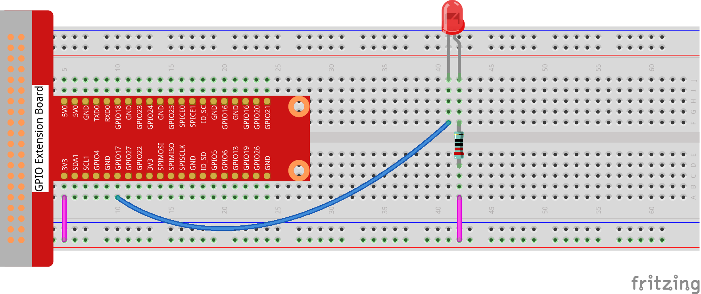

Lesson 1  Blinking LED
==========================

Introduction
---------------------------------

In this lesson, we will learn how to program Raspberry Pi to make an LED
blink. You can play numerous tricks with an LED as you want. Now get to
start and you will enjoy the fun of DIY at once!

Components
---------------------------------

\- 1 \* Raspberry Pi

\- 1 \* Breadboard

\- 1 \* LED

\- 1 \* Resistor (220Ω)

\- Jumper wires

Principle
---------------------------------

Semiconductor light-emitting diode is a type of component which can turn
electric energy into light energy via PN junctions. By wavelength, it
can be categorized into laser diode, infrared light-emitting diode and
visible light-emitting diode which is usually known as light-emitting
diode (LED).

When 2V-3V forward voltage is supplied to an LED, it will blink only if
forward currents flow through the LED. Usually there are red, yellow,
green, blue and color-changing LEDs which change color with different
voltages. LEDs are widely used due to their low operating voltage, low
current, luminescent stability and small size.

LEDs are diodes too. Hence they have a voltage drop which usually varies
from 1V to 3V depending on their types. Generally, they brighten if
supplied with a 5mA–30mA current, and we usually use 10mA–20mA. Thus
when an LED is used, it is necessary to connect a current-limiting
resistor to protect it from being burnt.

Schematic Diagram
---------------------------------

.. image:: media/image85.png
    :align: center

In this experiment, connect a 220Ω resistor to the anode of the LED,
then the resistor to 3.3 V, and connect the cathode of the LED to GPIO17
(See Raspberry Pi Pin Number Introduction). Write 1 to GPIO17, and the
LED will stay off; write 0 to GPIO17, and then the LED will blink, just
as indicated by the principle above.

Experimental Procedures
---------------------------------

**Step 1:** Build the circuit.

For C Language Users:
^^^^^^^^^^^^^^^^^^^^^^^^^^^^

**Step 2:** Change directory.

.. code-block:: 

    cd/home/pi/Sunfounder_SuperKit_C_code_for_RaspberryPi/01_LED

**Step 3:** Compile.

.. code-block:: 

    gcc led.c -o led -lwiringPi

**Step 4:** Run.

.. code-block:: 

    sudo ./led

**Code**

.. code-block:: c

    #include <wiringPi.h>
    #include <stdio.h>

    #define  LedPin    0

    int main(void)
    {
        if(wiringPiSetup() == -1){ //when initialize wiring failed,print messageto screen
            printf("setup wiringPi failed !");
            return 1; 
        }
        printf("linker LedPin : GPIO %d(wiringPi pin)\n",LedPin); //when initialize wiring successfully,print message to screen
        
        pinMode(LedPin, OUTPUT);

        while(1){
                digitalWrite(LedPin, LOW);  //led on
                printf("led on...\n");
                delay(500);
                digitalWrite(LedPin, HIGH);  //led off
                printf("...led off\n");
                delay(500);
        }

        return 0;
    }

For Python Users:
^^^^^^^^^^^^^^^^^^^^^^^^

**Step 2:** Change directory.

.. code-block:: 

    cd/home/pi/Sunfounder_SuperKit_Python_code_for_RaspberryPi/

**Step 3:** Run.

.. code-block:: 

    sudo python3 01_led.py

Now, you should see the LED blink.

**Code**

.. code-block:: python
    
    import RPi.GPIO as GPIO
    import time

    LedPin = 17

    def setup():
        GPIO.setmode(GPIO.BCM)       # Numbers GPIOs by BCM
        GPIO.setup(LedPin, GPIO.OUT)   # Set LedPin's mode is output
        GPIO.output(LedPin, GPIO.HIGH) # Set LedPin high(+3.3V) to off led

    def loop():
        while True:
            print ("...led on")
            GPIO.output(LedPin, GPIO.LOW)  # led on
            time.sleep(0.5)
            print ("led off...")
            GPIO.output(LedPin, GPIO.HIGH) # led off
            time.sleep(0.5)

    def destroy():
        GPIO.output(LedPin, GPIO.HIGH)     # led off
        GPIO.cleanup()                     # Release resource

    if __name__ == '__main__':     # Program start from here
        setup()
        try:
            loop()
        except KeyboardInterrupt:  # When 'Ctrl+C' is pressed, the child program destroy() will be  executed.
            destroy()

Further Exploration
------------------------

If you want the LED to speed up the blinking, just change the delay
time. For example, change the time to *delay (200)* in the program,
recompile and run, and then you will see the LED blink faster.

Summary
------------------------

Raspberry Pi packages many low-level detail designs, which enable you to
explore your own apps more conveniently. Maybe that is the charm of
Raspberry Pi.

Now you have already learnt how to use the Raspberry Pi GPIO to blink an
LED. Keep moving to the next contents.

**Tips：**

For any **TECHNICAL** questions, add a
topic under **FORUM** section on our website
`www.sunfounder.com <http://www.sunfounder.com>`__ and we'll reply as
soon as possible. For **NON-TECH** questions like order issues, please
**email** service@sunfounder.com.

