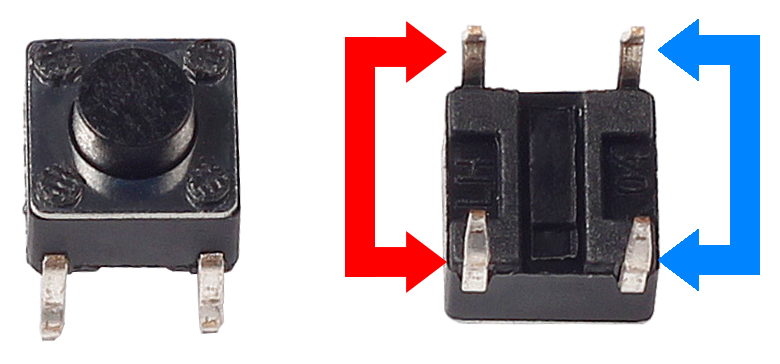
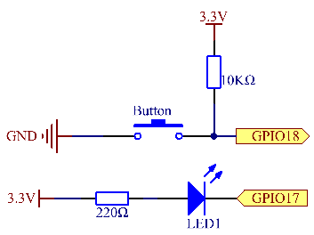
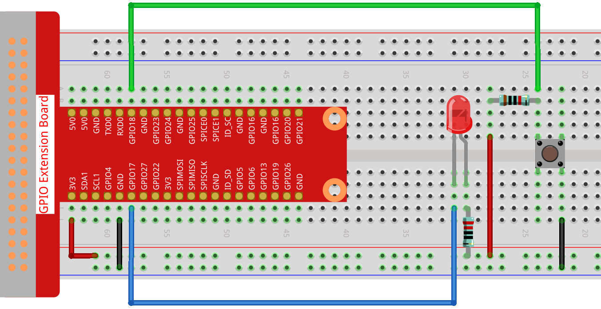
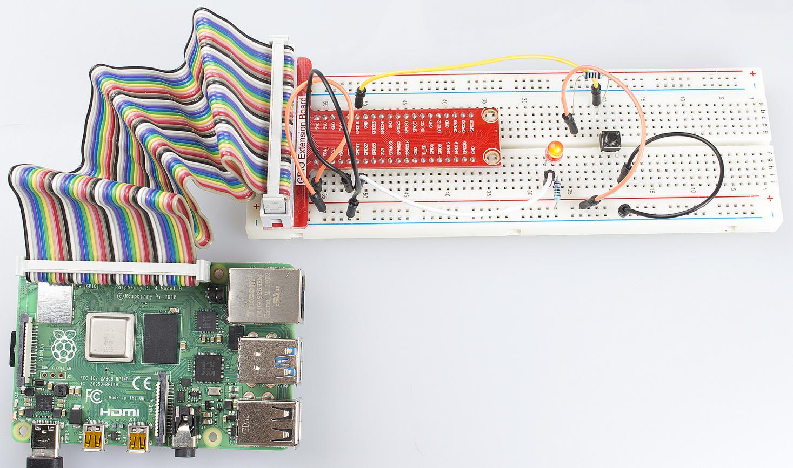

Lesson 2  Controlling an LED by a Button
==========================================

Introduction
-----------------------

In this lesson, we will learn how to turn an LED on or off by a button.

Components
-----------------------

\- 1 \* Raspberry Pi

\- 1 \* Breadboard

\- 1 \* LED

\- 1 \* Button

\- 1 \* Resistor (220Ω)

\- Jumper wires

Principle
-----------------------

**Button**

Buttons are a common component used to control electronic devices. They
are usually used as switches to connect or disconnect circuits. Although
buttons come in a variety of sizes and shapes, the one used here is a
6mm mini-button as shown in the following pictures. Pins pointed out by
the arrows of same color are meant to be connected.

When the button is pressed, the pins pointed by the blue arrow will
connect to the pins pointed by the red arrow (see the above figure),
thus closing the circuit, as shown in the following diagrams.

.. image:: media/image91.png
    :align: center

Generally, the button can be connected directly to the LED in a circuit
to turn on or off the LED, which is comparatively simple. However,
sometimes the LED will brighten automatically without any button
pressed, which is caused by various kinds of external interference. In
order to avoid this interference, a pull-up resistor is used – usually
connect a 1K–10KΩ resistor between the button and VCC. It can be
connected to VCC to consume the interference when the button is off.

Schematic Diagram
-------------------------

Use a normally open button as the input of Raspberry Pi. When the button
is pressed, the GPIO connected to the button will turn into low level
(0V). We can detect the state of the GPIO connected to the button
through programming. That is, if the GPIO turns into low level, it means
the button is pressed. You can run the corresponding code when the
button is pressed, and then the LED will light up.

Experimental Procedures
-------------------------

**Step 1**: Build the circuit.

For C Language Users:
^^^^^^^^^^^^^^^^^^^^^^^^

**Step 2:** Change directory.

.. code-block::

    cd/home/pi/Sunfounder_SuperKit_C_code_for_RaspberryPi/02_BtnAndLed/

**Step 3:** Compile.

.. code-block::

    gcc BtnAndLed.c -o BtnAndLed -lwiringPi

**Step 4:** Run.

.. code-block::

    sudo ./BtnAndLed

**Code**

.. code-block:: C

    #include <wiringPi.h>
    #include <stdio.h>

    #define LedPin    0
    #define ButtonPin 1

    int main(void)
    {
        if(wiringPiSetup() == -1){ //when initialize wiring failed,print messageto screen
            printf("setup wiringPi failed !");
            return 1; 
        }
        
        pinMode(LedPin, OUTPUT); 
        pinMode(ButtonPin, INPUT);

        pullUpDnControl(ButtonPin, PUD_UP);  //pull up to 3.3V,make GPIO1 a stable level
        while(1){
            digitalWrite(LedPin, HIGH);
            if(digitalRead(ButtonPin) == 0){ //indicate that button has pressed down
                digitalWrite(LedPin, LOW);   //led on
            }
        }

        return 0;
    }

**For Python Users:**

**Step 2:** Change directory.

.. code-block::

    cd/home/pi/Sunfounder_SuperKit_Python_code_for_RaspberryPi/

**Step 3:** Run.

.. code-block::

    sudo python3 02_btnAndLed.py

Now, press the button, and the LED will light up; press the button
again, and the LED will go out. At the same time, the state of the LED
will be printed on the screen.

**Code**

.. code-block:: python    
        
    import RPi.GPIO as GPIO
    import time
    
    LedPin = 17 
    BtnPin = 18
    
    Led_status = 1
    
    def setup():
        GPIO.setmode(GPIO.BCM)       # Numbers GPIOs by BCM
        GPIO.setup(LedPin, GPIO.OUT)   # Set LedPin's mode is output
        GPIO.setup(BtnPin, GPIO.IN, pull_up_down=GPIO.PUD_UP)    # Set BtnPin's mode is input, and pull up to high level(3.3V)
        GPIO.output(LedPin, GPIO.HIGH) # Set LedPin high(+3.3V) to off led
    
    def swLed(ev=None):
        global Led_status
        Led_status = not Led_status
        GPIO.output(LedPin, Led_status)  # switch led status(on-->off; off-->on)
        if Led_status == 1:
            print ("led off...")
        else:
            print ("...led on")
    
    def loop():
        GPIO.add_event_detect(BtnPin, GPIO.FALLING, callback=swLed, bouncetime=200) # wait for falling and set bouncetime to prevent the callback function from being called multiple times when the button is pressed
        while True:
            time.sleep(1)   # Don't do anything
    
    def destroy():
        GPIO.output(LedPin, GPIO.HIGH)     # led off
        GPIO.cleanup()                     # Release resource
    
    if __name__ == '__main__':     # Program start from here
        setup()
        try:
            loop()
        except KeyboardInterrupt:  # When 'Ctrl+C' is pressed, the child program destroy() will be  executed.
            destroy()

Summary
----------------

Through this experiment, you have learnt how to control the GPIOs of the
Raspberry Pi by programming.
