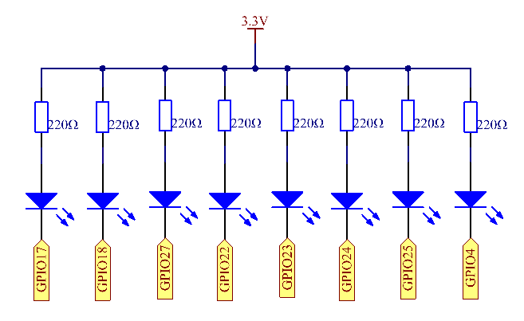
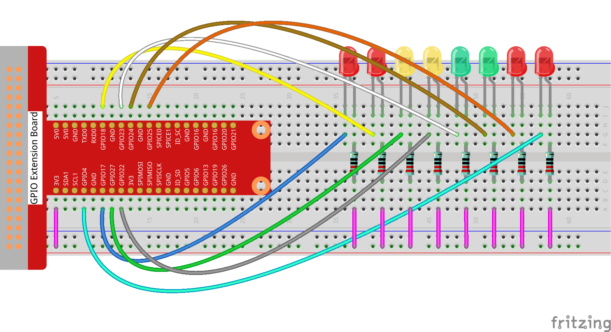
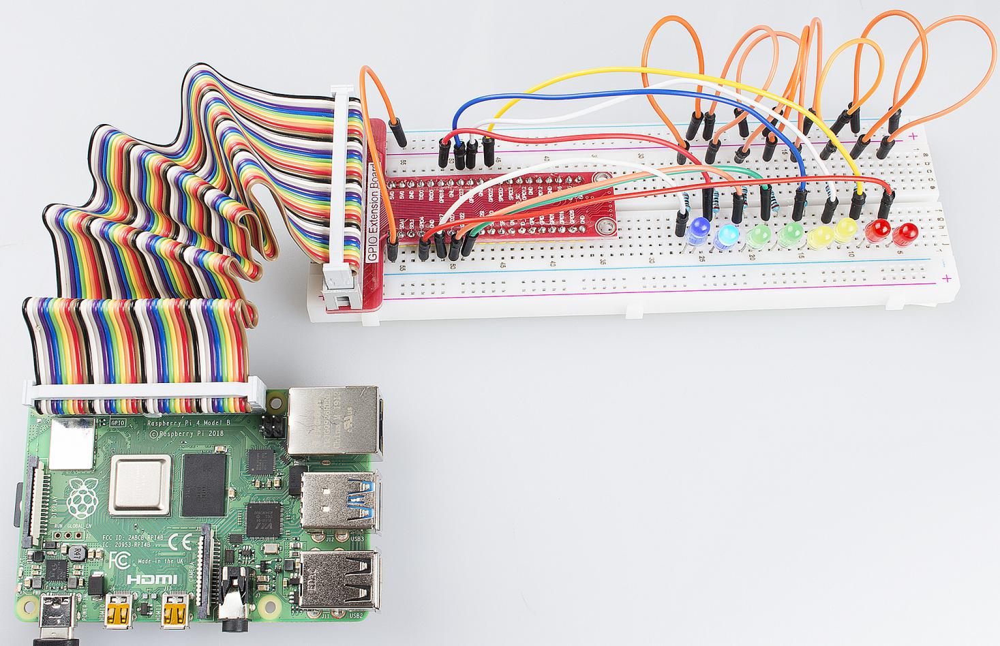

Lesson 3  Flowing LED Lights
==============================

Introduction
--------------------------

In this lesson, we will learn how to make eight LEDs blink in various
effects as you want based on Raspberry Pi.

Components
--------------------------

\- 1 \* Raspberry Pi

\- 1 \* Breadboard

\- 8 \* LED

\- 8 \* Resistor (220Ω)

\- Jumper wires

Schematic Diagram
--------------------------

Set GPIO17-GPIO25 to low level in turn by programming, and then
LED0-LED7 will light up in turn. You can make eight LEDs blink in
different effects by controlling their delay time and the order of
lighting up.

Experimental Procedures
--------------------------

**Step 1**: Build the circuit.

**Step 2:** GPIO4 is the default pin for onewire driver (w1-gpio). In
this lesson, we need to disable the onewire function and use it as an
output pin.

.. code-block::

    sudo nano /boot/config.txt

Commit the following line.

.. code-block::

    #dtoverlay = w1-gpio

For C Language Users:
^^^^^^^^^^^^^^^^^^^^^^^^^

**Step 3:** Change directory.

.. code-block::

    cd/home/pi/Sunfounder_SuperKit_C_code_for_RaspberryPi/03_8Led/

**Step 4:** Compile.

.. code-block::

    gcc 8Led.c -o 8Led -lwiringPi

**Step 5:** Run.

.. code-block::

    sudo ./8Led

**Code**

.. code-block:: c

    #include <wiringPi.h>
    #include <stdio.h>
    
    //make led_n on
    void led_on(int n)
    {
        digitalWrite(n, LOW);
    }
    
    //make led_n off
    void led_off(int n)
    {
        digitalWrite(n, HIGH);
    }
    
    int main(void)
    {
        int i;
    
        if(wiringPiSetup() == -1){ //when initialize wiring failed,print messageto screen
            printf("setup wiringPi failed !");
            return 1; 
        }
    
        for(i=0;i<8;i++){
            printf("linker LedPin : GPIO %d(wiringPi pin)\n",i); //when initialize wiring successfully,print message to screen
        }
    
        for(i=0;i<8;i++){       //make 8 pins' mode is output
            pinMode(i, OUTPUT);
        }
    
        while(1){
            for(i=0;i<8;i++){   //make led on from left to right
                led_on(i);
                delay(100);
                led_off(i);
            }
        //	delay(500);
            for(i=8;i>=0;i--){  //make led off from right to left
                led_on(i);
                delay(100);
                led_off(i);
            }
        }
    
        return 0;
    }

For Python Users:
^^^^^^^^^^^^^^^^^^^^^^

**Step 3:** Change directory.

.. code-block::

    cd/home/pi/Sunfounder_SuperKit_Python_code_for_RaspberryPi/

**Step 4:** Run.

.. code-block::

    sudo python3 03_8Led.py

Then you will see eight LEDs brighten and dim left to right and right to
left circularly, just like flowing water.

**Code**

.. code-block:: python

    import RPi.GPIO as GPIO
    import time
    
    pins = [17, 18, 27, 22, 23, 24, 25, 4]
    
    def setup():
        GPIO.setmode(GPIO.BCM)        # Numbers GPIOs by BCM
        for pin in pins:
            GPIO.setup(pin, GPIO.OUT)   # Set all pins' mode is output
            GPIO.output(pin, GPIO.HIGH) # Set all pins to high(+3.3V) to off led
    
    def loop():
        while True:
            for pin in pins:
                GPIO.output(pin, GPIO.LOW)	
                time.sleep(0.05)
                GPIO.output(pin, GPIO.HIGH)
            for pin in reversed(pins):
                GPIO.output(pin, GPIO.LOW)
                time.sleep(0.05)
                GPIO.output(pin, GPIO.HIGH)
    
    def destroy():
        for pin in pins:
            GPIO.output(pin, GPIO.HIGH)    # turn off all leds
        GPIO.cleanup()                     # Release resource
    
    if __name__ == '__main__':     # Program start from here
        setup()
        try:
            loop()
        except KeyboardInterrupt:  # When 'Ctrl+C' is pressed, the child program destroy() will be  executed.
            destroy()

**Further Exploration**

You can write the blinking effects of LEDs in an array. If you want to
use one of these effects, you can call it in the *main()* function
directly.
