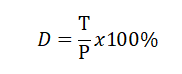
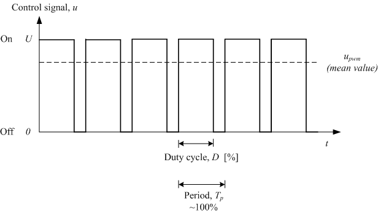
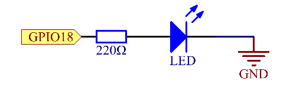
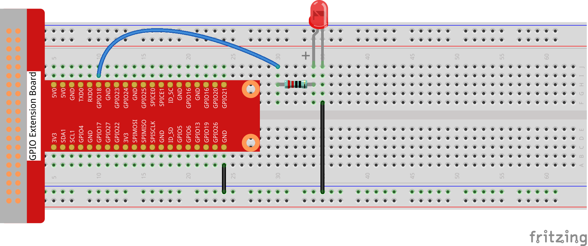
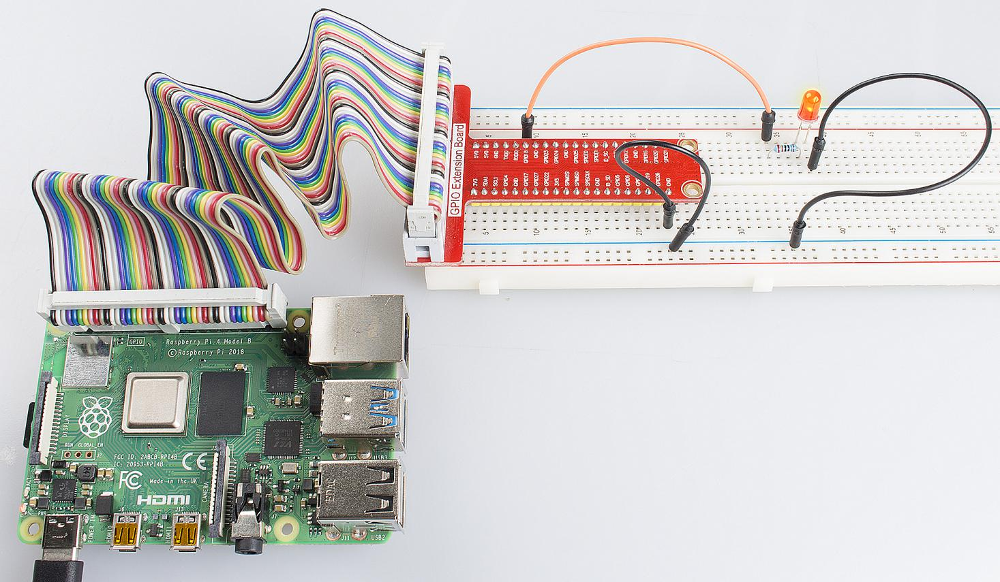

Lesson 4  Breathing LED
=========================

Introduction
-----------------

In this lesson, we will try something interesting – gradually increase
and decrease the luminance of an LED with PWM, just like breathing. So
we give it a magical name - Breathing LED.

Components
-----------------

\- 1 \* Raspberry Pi

\- 1 \* Breadboard

\- 1 \* LED

\- 1 \* Resistor (220Ω)

\- Jumper wires

Principle
-----------------

**PWM**

Pulse Width Modulation, or PWM, is a technique for getting analog
results with digital means. Digital control is used to create a square
wave, a signal switched between on and off. This on-off pattern can
simulate voltages in between full on (3.3 Volts) and off (0 Volts) by
changing the portion of the time the signal spends on versus the time
that the signal spends off. The duration of \"on time\" is called pulse
width. To get varying analog values, you change, or modulate, that
width. If you repeat this on-off pattern fast enough with some device,
an LED for example, the result would be like this: the signal is a
steady voltage between 0 and 3.3v controlling the brightness of the LED.
(See the PWM description on the official website of Arduino)

**Duty Cycle**

A duty cycle is the percentage of one period in which a signal is
active. A period is the time it takes for a signal to complete an
on-and-off cycle. As a formula, a duty cycle may be expressed as:

where **D** is the duty cycle, **T** is the time the signal is active,
and **P** is the total period of the signal. Thus, a 60% duty cycle
means the signal is on 60% of the time but off 40% of the time. The \"on
time\" for a 60% duty cycle could be a fraction of a second, a day, or
even a week, depending on the length of the period.

In this experiment, we use this technology to make the LED brighten and
dim slowly so it looks like our breath.

Schematic Diagram
------------------------------

Experimental Procedures
------------------------------

**Step 1:** Build the circuit.

For C Language Users:
^^^^^^^^^^^^^^^^^^^^^^^^

**Step 2:** Change directory.

.. code-block::
    
    cd/home/pi/Sunfounder_SuperKit_C_code_for_RaspberryPi/04_PwmLed

**Step 3**: Compile.

.. code-block::
    
    gcc PwmLed.c -o PwmLed -lwiringPi -lpthread

**Step 4**: Run.

.. code-block::
    
    sudo ./PwmLed

**Code**

.. code-block:: c   

    #include <wiringPi.h>
    #include <softPwm.h>
    #include <stdio.h>
    
    #define LedPin    1
    
    int main(void)
    {
        int i;
    
        if(wiringPiSetup() == -1){ //when initialize wiring failed,print messageto screen
            printf("setup wiringPi failed !");
            return 1;
        }
    
        softPwmCreate(LedPin, 0, 100);
    
        while(1){
            for(i=0;i<=100;i++){
                softPwmWrite(LedPin, i);
                delay(20);
            }
            delay(1000);
            for(i=100;i>=0;i--){
                softPwmWrite(LedPin, i);
                delay(20);
            }
        }
    
        return 0;
    }
    

For Python Users:
^^^^^^^^^^^^^^^^^^^^^^^^

**Step 2:** Change directory.

.. code-block::
    
    cd/home/pi/Sunfounder_SuperKit_Python_code_for_RaspberryPi/

**Step 3**: Run.

.. code-block::
    
    sudo python3 04_pwmLed.py

Now you will see the gradual change of the LED luminance, between bright
and dim.

**Code**

.. code-block:: python
    
    import RPi.GPIO as GPIO
    import time

    LedPin = 18

    def setup():
        global p
        GPIO.setmode(GPIO.BCM)       # Numbers GPIOs by BCM
        GPIO.setup(LedPin, GPIO.OUT)   # Set LedPin's mode is output
        GPIO.output(LedPin, GPIO.LOW)  # Set LedPin to low(0V)

        p = GPIO.PWM(LedPin, 1000)     # set Frequece to 1KHz
        p.start(0)                     # Duty Cycle = 0

    def loop():
        while True:
            for dc in range(0, 101, 4):   # Increase duty cycle: 0~100
                p.ChangeDutyCycle(dc)     # Change duty cycle
                time.sleep(0.05)
            time.sleep(1)
            for dc in range(100, -1, -4): # Decrease duty cycle: 100~0
                p.ChangeDutyCycle(dc)
                time.sleep(0.05)
            time.sleep(1)

    def destroy():
        p.stop()
        GPIO.cleanup()

    if __name__ == '__main__':     # Program start from here
        setup()
        try:
            loop()
        except KeyboardInterrupt:  # When 'Ctrl+C' is pressed, the child program destroy() will be  executed.
            destroy()

Summary
-------------

Through this experiment, you should have mastered the principle of PWM
and how to program Raspberry Pi with PWM. You can try to apply this
technology to DC motor speed regulation later.
