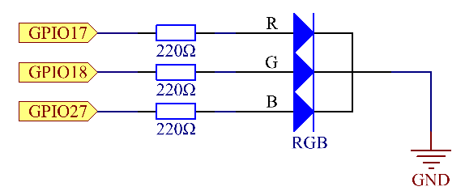
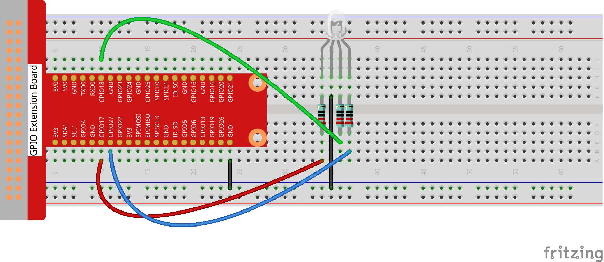
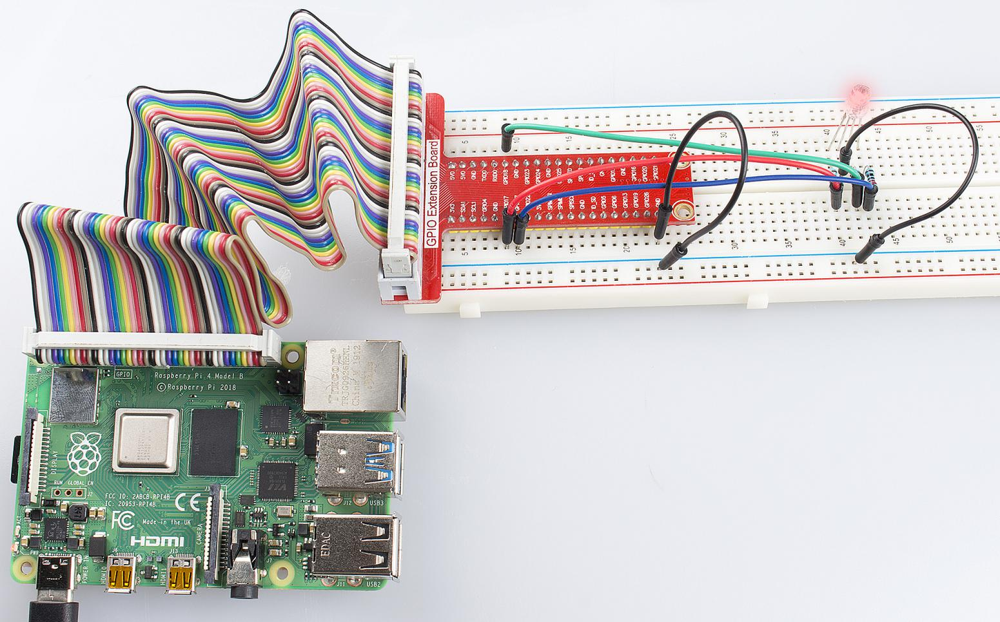

Lesson 5  RGB LED
==================

Introduction
-------------------

Previously we've used the PWM technology to control an LED brighten and
dim. In this lesson, we will use it to control an RGB LED to flash
various kinds of colors.

Components
-------------------

\- 1 \* Raspberry Pi

\- 1 \* Breadboard

\- 1 \* RGB LED

\- 3 \* Resistor (220Ω)

\- Several jumper wires

Principle
-------------------

**RGB**

RGB LEDs emit light in various colors. RGB stands for the red, green,
and blue color channels and is an industry color standard. They package
three LEDs of red, green, and blue into a transparent or semitransparent
plastic shell and have four pins. An RGB LED can display various new
colors by changing the three channels and superimposing them, which,
according to statistics, can create 16,777,216 different colors.

The three primary colors can be mixed into various colors by brightness.
The brightness of LED can be adjusted with PWM. Raspberry Pi has only
one channel for hardware PWM output, but it needs three channels to
control the RGB LED, which means it is difficult to control the RGB LED
with the hardware PWM of Raspberry Pi. Fortunately, the *softPwm*
library simulates PWM (softPwm) by programming. You only need to include
the header file *softPwm.h* (for C language users), and then call the
API it provides to easily control the RGB LED by multi-channel PWM
output, so as to display all kinds of color.

RGB LEDs can be categorized into common anode and common cathode ones.
In this experiment, the latter is used.

Schematic Diagram
------------------------

Experimental Procedures
------------------------

**Step 1:** Build the circuit.

For C Language Users:
^^^^^^^^^^^^^^^^^^^^^^^^^

**Step 2:** Change directory.

.. code-block::

    cd/home/pi/Sunfounder_SuperKit_C_code_for_RaspberryPi/05_RGB/

**Step 3:** Compile.

.. code-block::

    gcc rgb.c -o rgb -lwiringPi -lpthread

**Step 4:** Run.

.. code-block::

    sudo ./rgb

For Python Users:
^^^^^^^^^^^^^^^^^^^^

**Step 2:** Change directory.

.. code-block::

    cd/home/pi/Sunfounder_SuperKit_Python_code_for_RaspberryPi/

**Step 3:** Run.

.. code-block::

    sudo python3 05_rgb.py

Here you should see the RGB LED flash different colors in turn.

Further Exploration
-----------------------

You can modify the parameters of the function *ledColorSet( )* by
yourself, and then compile and run the code to see the color changes of
the RGB LED.

Experimental Summary
-----------------------

In this experiment, you have learnt how to control RGB LEDs with the
softPwm of Raspberry Pi in this experiment. Try to apply the softPwm to
DC motor speed regulation.
