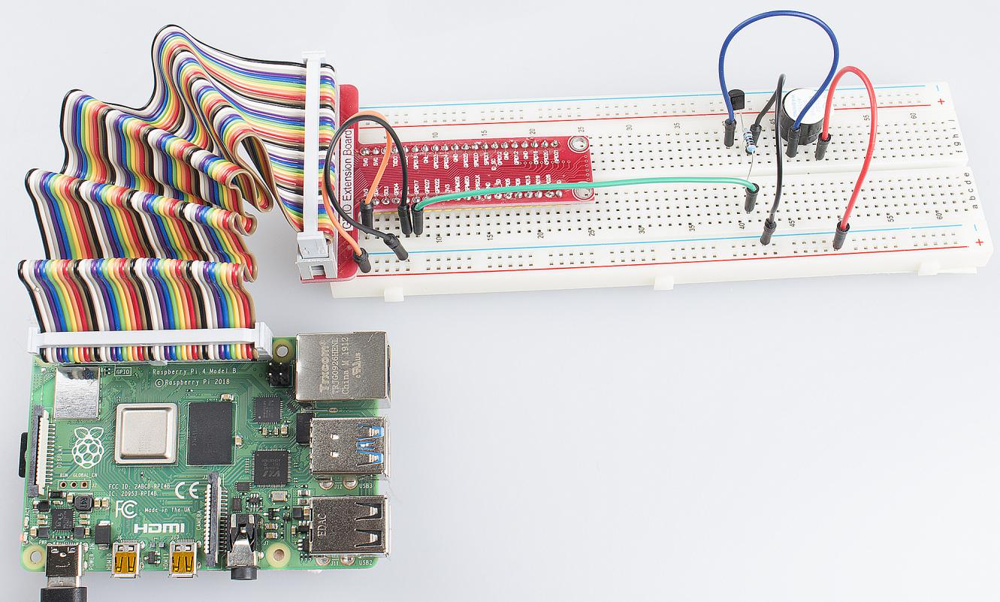

Lesson 6  Buzzer
=================

Introduction
--------------------

In this lesson, we will learn how to drive an active buzzer to beep with
a PNP transistor.

Components
--------------------

\- 1 \* Raspberry Pi

\- 1 \* Breadboard

\- 1 \* Buzzer (Active)

\- 1 \* PNP transistor (8550)

\- 1 \* Resistor (1KΩ)

\- Jumper wires

Principle
--------------------

As a type of electronic buzzer with integrated structure, buzzers, which
are supplied by DC power, are widely used in computers, printers,
photocopiers, alarms, electronic toys, automotive electronic devices,
telephones, timers and other electronic products for voice devices.
Buzzers can be categorized as active and passive ones (see the following
picture). Turn the pins of two buzzers face up, and the one with a green
circuit board is a passive buzzer, while the other enclosed with a black
tape is an active one.

The difference between an active buzzer and a passive buzzer is:

An active buzzer has a built-in oscillating source, so it will make
sounds when electrified. But a passive buzzer does not have such source,
so it will not beep if DC signals are used; instead, you need to use
square waves whose frequency is between 2K and 5K to drive it. The
active buzzer is often more expensive than the passive one because of
multiple built-in oscillating circuits.

Schematic Diagram
--------------------

In this experiment, an active buzzer is used. When the GPIO of Raspberry
Pi output is supplied with low level (0V) by programming, the transistor
will conduct because of current saturation and the buzzer will make
sounds. But when high level is supplied to the IO of Raspberry Pi, the
transistor will be cut off and the buzzer will not make sounds.

.. image:: media/image109.png
    :align: center

Experimental Procedures
-------------------------------

**Step 1:** Build the circuit (Pay attention to the positive and
negative poles of the buzzer)

.. image:: media/image110.png
    :align: center

For C Language Users:
^^^^^^^^^^^^^^^^^^^^^^^^^^

**Step 2**: Change directory.

.. raw:: html

    <run></run>

.. code-block::

    cd /home/pi/Sunfounder_SuperKit_C_code_for_RaspberryPi/06_Beep/

**Step 3:** Compile.

.. raw:: html

    <run></run>

.. code-block::

    gcc beep.c -o beep -lwiringPi

**Step 4:** Run.

.. raw:: html

    <run></run>

.. code-block::

    sudo ./beep

.. note::

    If it does not work after running, please refer to :ref:`C code is not working?`

**Code**

.. code-block:: c
    
    #include <wiringPi.h>
    #include <stdio.h>

    #define BeepPin 0

    int main(void)
    {
        if(wiringPiSetup() == -1){ //when initialize wiring failed,print messageto screen
            printf("setup wiringPi failed !");
            return 1; 
        }
        
        pinMode(BeepPin, OUTPUT);   //set GPIO0 output

        while(1){
            digitalWrite(BeepPin, LOW);  //beep on
            delay(100);                  //delay
            digitalWrite(BeepPin, HIGH); //beep off
            delay(100);                  //delay
        }

        return 0;
    }

For Python Users:
^^^^^^^^^^^^^^^^^^^

**Step 2:** Change directory.

.. raw:: html

    <run></run>

.. code-block::

    cd /home/pi/Sunfounder_SuperKit_Python_code_for_RaspberryPi/

**Step 3:** Run.

.. raw:: html

    <run></run>

.. code-block::

    sudo python3 06_beep.py

Now, you should hear the buzzer make sounds.

**Code**    
    
.. raw:: html

    <run></run>

.. code-block:: python

    import RPi.GPIO as GPIO
    import time

    BeepPin = 17

    def setup():
        GPIO.setmode(GPIO.BCM)        # Numbers GPIOs by BCM
        GPIO.setup(BeepPin, GPIO.OUT)   # Set BeepPin's mode is output
        GPIO.output(BeepPin, GPIO.HIGH) # Set BeepPin high(+3.3V) to off beep

    def loop():
        while True:
            GPIO.output(BeepPin, GPIO.LOW)
            time.sleep(0.1)
            GPIO.output(BeepPin, GPIO.HIGH)
            time.sleep(0.1)

    def destroy():
        GPIO.output(BeepPin, GPIO.HIGH)    # beep off
        GPIO.cleanup()                     # Release resource

    if __name__ == '__main__':     # Program start from here
        print ("Press Ctrl+C to end the program...")
        setup()
        try:
            loop()
        except KeyboardInterrupt:  # When 'Ctrl+C' is pressed, the child program destroy() will be  executed.
            destroy()
    
        

Further Exploration
-------------------------

If you have a passive buzzer in hand, you can replace the active buzzer
with it. Now you can make a buzzer sound like “do re mi fa so la si do”
with just some basic knowledge of programming. Give a try!
