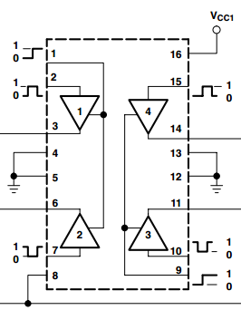
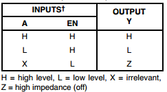
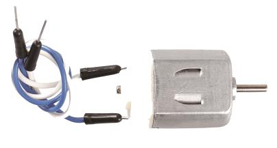
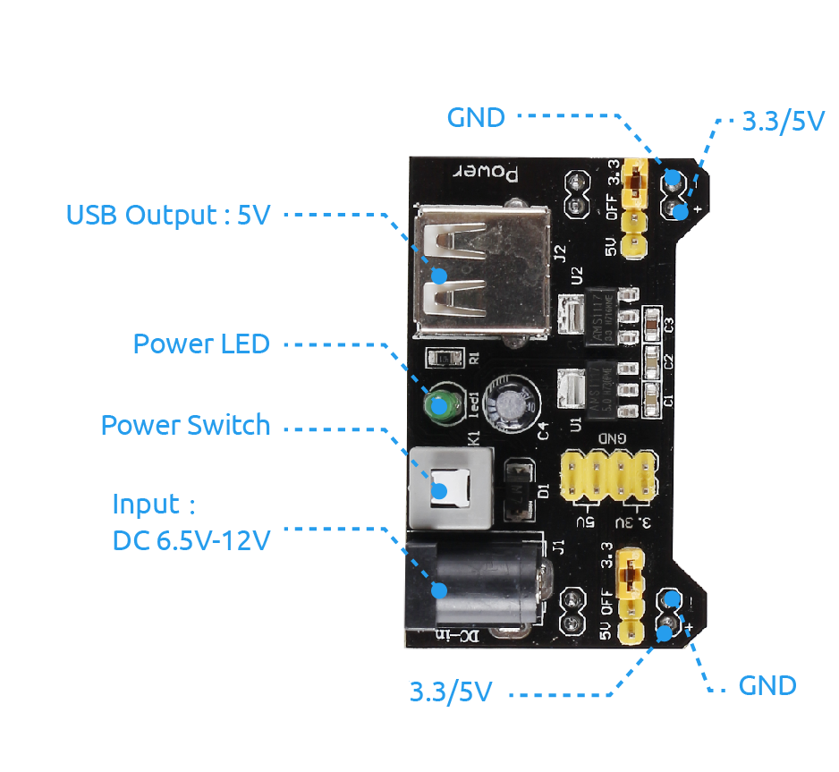
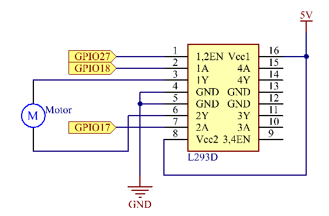
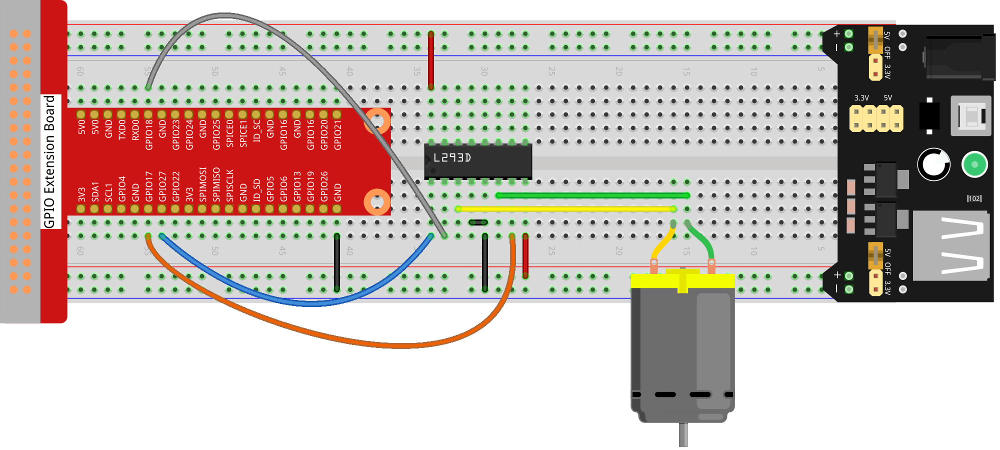
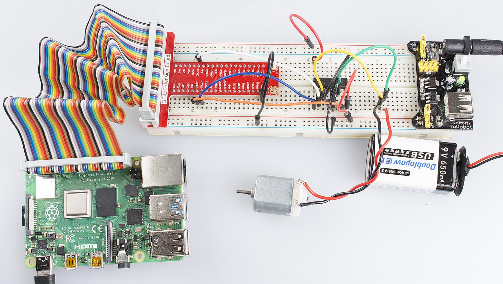

Lesson 7  How to Drive a DC Motor
==================================

Introduction
-------------------

In this lesson, we will learn to how to use L293D to drive a DC motor
and make it rotate clockwise and counterclockwise.

Components
-------------------

\- 1 \* Raspberry Pi

\- 1 \* Breadboard

\- 1 \* L293D

\- 1 \* DC motor

\- 1 \* Power Module

\- Jumper wires

Principle
-------------------

**L293D**

L293D is a 4-channel motor driver integrated by chip with high voltage
and high current. It's designed to connect to standard DTL, TTL logic
level, and drive inductive loads (such as relay coils, DC, Stepper
Motors) and power switching transistors etc. DC Motors are devices that
turn DC electrical energy into mechanical energy. They are widely used
in electrical drive for their superior speed regulation performance.

See the figure of pins below. L293D has two pins (Vcc1 and Vcc2) for
power supply. Vcc2 is used to supply power for the motor, while Vcc1 to
supply for the chip.

.. image:: media/image112.png
    :align: center

The following is the internal structure of L293D. Pin EN is an enable
pin and only works with high level; A stands for input and Y for output.
You can see the relationship among them at the right bottom. When pin EN
is High level, if A is High, Y outputs high level; if A is Low, Y
outputs Low level. When pin EN is Low level, the L293D does not work.

**DC Motor**

This is a 5V DC motor. It will rotate when you give the two terminals of
the copper sheet one high and one low level. For convenience, you can
weld the pins to it.

   Size: 25*20*15MM 
   
   Operation Voltage: 1-6V

   Free-run current (3V): 70mA 
   
   Free-run speed (3V): 13000RPM

   Stall current (3V): 800mA 
   
   Shaft diameter: 2mm

**Power Supply Module**

In this experiment, it needs large currents to drive the motor
especially when it starts and stops, which will severely interfere with
the normal work of Raspberry Pi. Therefore, we separately supply power
for the motor by this module to make it run safely and steadily.

You can just plug it in the breadboard to supply power. It provides a
voltage of 3.3V and 5V, and you can connect either via a jumper cap
included.

**Schematic Diagram**

Plug the power supply module in breadboard, and insert the jumper cap to
pin of 5V, then it will output voltage of 5V. Connect pin 1 of L293D to
GPIO22, and set it as high level. Connect pin2 to GPIO27, and pin7 to
GPIO17, then set one pin high, while the other low. Thus you can change
the motor’s rotation direction.

Experimental Procedures
------------------------------

**Step 1:** Build the circuit.

For C Language Users:
^^^^^^^^^^^^^^^^^^^^^^^^^^^^

**Step 2:** Change directory.

.. code-block::

    cd/home/pi/Sunfounder_SuperKit_C_code_for_RaspberryPi/07_Motor/

**Step 3:** Compile.

.. code-block::

    gcc motor.c -o motor -lwiringPi

**Step 4:** Run.

.. code-block::

    sudo ./motor

For Python Users:
^^^^^^^^^^^^^^^^^^^^^^^

**Step 2:** Change directory.

.. code-block::

    cd/home/pi/Sunfounder_SuperKit_Python_code_for_RaspberryPi/

**Step 3:** Run.

.. code-block::

    sudo python3 07_motor.py

Now, you should see the motor blade rotating.

Further Exploration
----------------------------

You can use buttons to control the clockwise and counterclockwise
rotation of the motor blade based on the previous lessons. Also you can
apply the PWM technology to control the rotation.

Summary
----------------------------

Through this lesson, you have learnt the relative principle and driving
mode of DC motors, as well as how to drive a motor by Raspberry Pi. You
should also pay special attention to the fact that a DC motor will
greatly interfere with the whole circuit when it works, so you need to
adopt photoelectric isolation and provide separate power supply. A
freewheeling diode is also necessary for the whole system to work
reliably and steadily.
