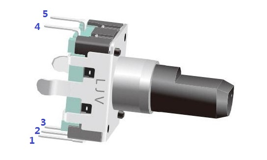
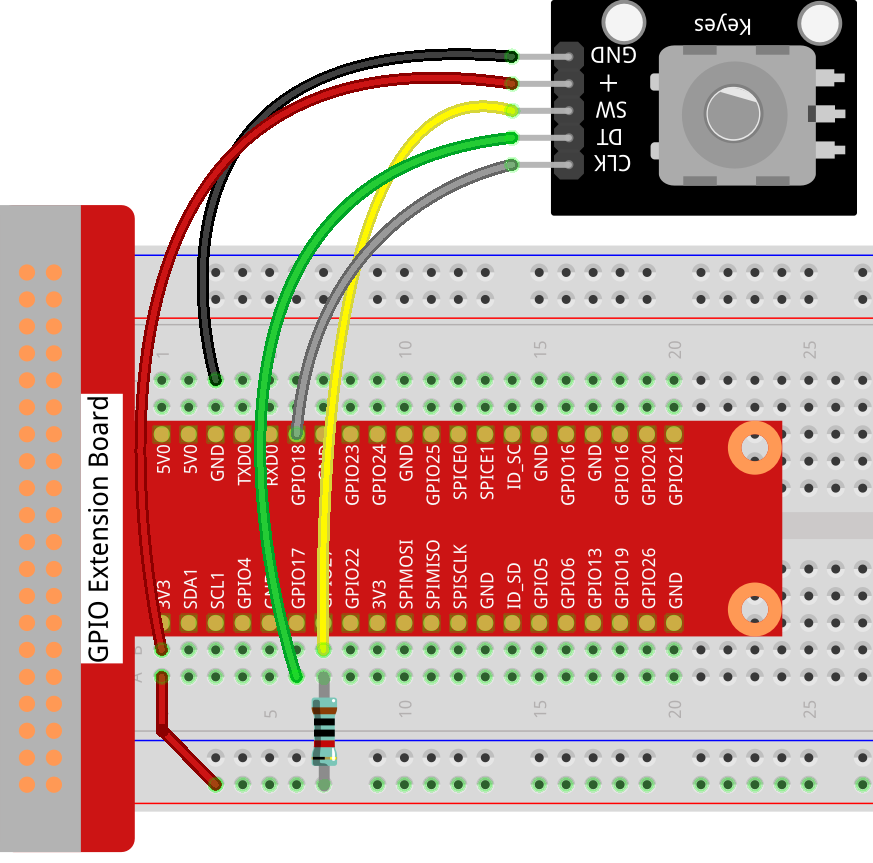
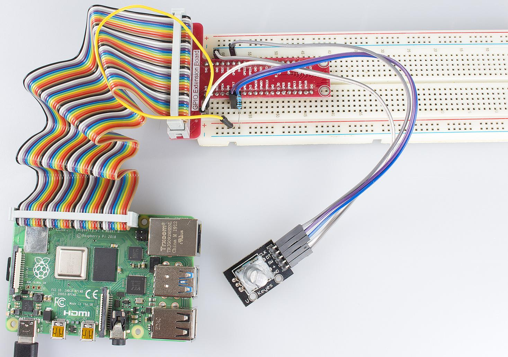

Lesson 8  Rotary Encoder
===========================

Introduction
----------------

A rotary encoder is a type of electro-mechanical device that converts
the angular position or motion of a shaft or axle to an analog or
digital code. In this lesson, we will learn how to use this device.

Components
----------------

\- 1 \* Raspberry Pi

\- 1 \* Breadboard

\- 1 \* Rotary Encoder Module

\- Jumper wires

Principle
----------------

A rotary encoder is an electronic switch with a set of regular pulses
with strictly timing sequence. When used with IC, it can achieve
increment, decrement, page turning and other operations such as mouse
scrolling, menu selection, acoustic sound regulation, frequency
regulation, toaster temperature regulation, and so on.

There are mainly two types of rotary encoders: absolute and incremental
(relative) encoders. The output of absolute encoders indicates the
current position of the shaft, making them angle transducers. The output
of incremental encoders provides information about the motion of the
shaft, which is typically further processed elsewhere into information
such as speed, distance, and position.

Most rotary encoders have 5 pins with three functions of turning left,
turning right and pressing down:

**Pin 4 & 5**: switching wiring terminals for pressing down (no
different from the buttons mentioned previously, so no more details will
be provided here.)

**Pin 2**: generally connected to ground.

**Pin 1 & 3**: first connected to a pull-up resistor and then to a
microprocessor (in this experiment, to GPIO0 and GPIO1 of Raspberry Pi);
when you spin the knob of the encoder clockwise and counterclockwise,
there will be pulse outputs in pin 1 and pin 3.

If both GPIO0 and GPIO1 are at high level, the switch rotates clockwise;
if GPIO0 is at high level but GPIO1 is low, the switch rotates
counterclockwise. Therefore, when programming, you only need to check
the state of pin 3 when pin 1 is at high level, and then you can tell
whether the switch rotates clockwise or counterclockwise.

**Step 1:** Build the circuit.

+--------------+----------------+
| Raspberry Pi | Rotary Encoder |
+--------------+----------------+
| 3.3V         |  \+            |
+--------------+----------------+
| GND          | GND            |
+--------------+----------------+
| GPIO17       | DT             |
+--------------+----------------+
| GPIO18       | CLK            |
+--------------+----------------+
| GPIO27       | SW             |
+--------------+----------------+

For C Language Users:
^^^^^^^^^^^^^^^^^^^^^^^^^

**Step 2:** Change directory.

.. code-block::

    cd/home/pi/Sunfounder_SuperKit_C_code_for_RaspberryPi/08_RotaryEncoder/

**Step 3:** Compile.

.. code-block::

    gcc rotaryEncoder.c -o rotaryEncoder **-**\ lwiringPi

**Step 4:** Run.

.. code-block::

    sudo ./rotaryEncoder

**Code**

.. code-block:: c   

    #include <stdio.h>
    #include <string.h>
    #include <errno.h>
    #include <stdlib.h>
    #include <wiringPi.h>
    
    #define  RoAPin    0
    #define  RoBPin    1
    #define  RoSPin    2
    
    static volatile int globalCounter = 0 ;
    
    unsigned char flag;
    unsigned char Last_RoB_Status;
    unsigned char Current_RoB_Status;
    
    void rotaryDeal(void)
    {
        Last_RoB_Status = digitalRead(RoBPin);
    
        while(!digitalRead(RoAPin)){
            Current_RoB_Status = digitalRead(RoBPin);
            flag = 1;
        }
    
        if(flag == 1){
            flag = 0;
            if((Last_RoB_Status == 0)&&(Current_RoB_Status == 1)){
                globalCounter ++;
                printf("globalCounter : %d\n",globalCounter);
            }
            if((Last_RoB_Status == 1)&&(Current_RoB_Status == 0)){
                globalCounter --;
                printf("globalCounter : %d\n",globalCounter);
            }
    
        }
    }
    
    void rotaryClear(void)
    {
        if(digitalRead(RoSPin) == 0)
        {
            globalCounter = 0;
            printf("globalCounter : %d\n",globalCounter);
            delay(1000);
        }
    }
    
    int main(void)
    {
        if(wiringPiSetup() < 0){
            fprintf(stderr, "Unable to setup wiringPi:%s\n",strerror(errno));
            return 1;
        }
    
        pinMode(RoAPin, INPUT);
        pinMode(RoBPin, INPUT);
        pinMode(RoSPin, INPUT);
    
        pullUpDnControl(RoSPin, PUD_UP);
    
        while(1){
            rotaryDeal();
            rotaryClear();
        }
    
        return 0;
    }

For Python Users:
^^^^^^^^^^^^^^^^^^^^^

**Step 2:** Change directory.

.. code-block::

    cd/home/pi/Sunfounder_SuperKit_Python_code_for_RaspberryPi/

**Step 3:** Run.

.. code-block::

    sudo python3 08_rotaryEncoder.py

Now, gently rotate the encoder to change the value of the variable in
the above program, and you will see the value printed on the screen.
Rotate the encoder clockwise, the value will increase; or rotate it
counterclockwise, the value will decrease.

**Code**    
    
.. code-block:: python

    import RPi.GPIO as GPIO
    import time
    
    # Set up pins
    # Rotary A Pin
    RoAPin = 17
    # Rotary B Pin
    RoBPin = 18
    # Rotary Switch Pin
    RoSPin = 27
    
    def setup():
        global counter
        global Last_RoB_Status, Current_RoB_Status
        GPIO.setmode(GPIO.BCM)
        GPIO.setup(RoAPin, GPIO.IN)
        GPIO.setup(RoBPin, GPIO.IN)
        GPIO.setup(RoSPin,GPIO.IN, pull_up_down=GPIO.PUD_UP)
        # Set up a falling edge detect to callback clear
        GPIO.add_event_detect(RoSPin, GPIO.FALLING, callback=clear)
    
        # Set up a counter as a global variable
        counter = 0
        Last_RoB_Status = 0
        Current_RoB_Status = 0
    
    # Define a function to deal with rotary encoder
    def rotaryDeal():
        global counter
        global Last_RoB_Status, Current_RoB_Status
    
        flag = 0
        Last_RoB_Status = GPIO.input(RoBPin)
        # When RoAPin level changes
        while(not GPIO.input(RoAPin)):
            Current_RoB_Status = GPIO.input(RoBPin)
            flag = 1
        if flag == 1:
            # Reset flag
            flag = 0
            if (Last_RoB_Status == 0) and (Current_RoB_Status == 1):
                counter = counter + 1
            if (Last_RoB_Status == 1) and (Current_RoB_Status == 0):
                counter = counter - 1
            print ("counter = %d" % counter)
    
    # Define a callback function on switch, to clean "counter"
    def clear(ev=None):
        global counter
        counter = 0
        print ("counter = %d" % counter)
        
    def main():
        while True:
            rotaryDeal()
    
    def destroy():
        # Release resource
        GPIO.cleanup()  
    
    # If run this script directly, do:
    if __name__ == '__main__':
        setup()
        try:
            main()
        # When 'Ctrl+C' is pressed, the child program 
        # destroy() will be  executed.
        except KeyboardInterrupt:
            destroy()

Further Exploration
----------------------

In this experiment, the pressing down function of rotary encoder is not
involved. Try to explore this function by yourself!

