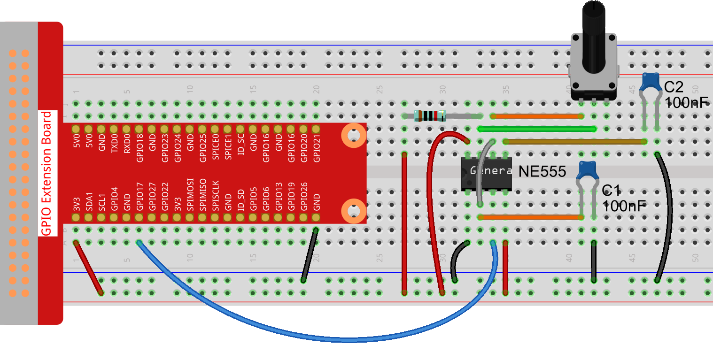

Lesson 9  555 Timer
======================

Introduction
----------------

The NE555 Timer, a mixed circuit composed of analog and digital
circuits, integrates analog and logical functions into an independent
IC, thus tremendously expanding the applications of analog integrated
circuits. It is widely used in various timers, pulse generators, and
oscillators. In this lesson, we will learn how to use the 555 timer.

Components
----------------

\- 1 \* Raspberry Pi

\- 1 \* Breadboard

\- 1 \* NE555

\- 3 \* Resistor (1 \* 1KΩ, 2 \* 10KΩ)

\- 2 \* Capacitor (100nF)

\- Jumper wires

Principle
----------------

**555 IC**

A 555 timer is a medium-sized IC device which combines analog and
digital functions. With low cost and reliable performance, it just
attaches external resistors and capacitors so as to achieve the
functions of multivibrator, monostable trigger, Schmitt trigger and
other circuits which can generate and transform pulses. It is also used
frequently as a timer and widely applied to instruments, household
appliances, electronic measurement, automatic control and other fields.

Its pins and their functions:

As shown in the picture, the pins are set dual in-line with the 8-pin
package.

\-  Pin 1 (**GND**): the ground

\-  Pin 2 (**TRIGGER**): the input of lower comparator

\-  Pin 3 (**OUTPUT**): having two states of 0 and 1 decided by the input electrical level

\-  Pin 4 (**RESET**): outputting low level when supplied a low one

\-  Pin 5 (**CONTROL VOLTAGE**): changing the upper and lower level trigger values

\-  Pin 6 (**THRESHOLD**): the input of the upper comparator

\-  Pin 7 (**DISCHARGE**): having two states of suspension and ground connection also decided by the input, and the output of the internal discharge tube

\-  Pin 8 (**VCC**): the power supply

The 555 timer can work under three modes. In this experiment, the
astable mode is used to generate square waves.

Under the astable mode, the frequency of output waveform of the 555
timer is determined by R\ :sub:`1`, R\ :sub:`2` and C\ :sub:`2` :

.. math:: f = \ \frac{1}{ln2\ *\ C_{2}\ *\ \left( R_{1}\  + \ 2R_{2} \right)}

In the above circuit, R\ :sub:`1`\ = R\ :sub:`2`\ =10KΩ= 10\ :sup:`4`\ Ω; =100nF=10\ :sup:`-7`\ F, so
we can get the frequency:

.. math:: f = \ \frac{1}{ln2*\ 10^{- 7}*(10^{4} + \ 2*10^{4})}\  \approx 481Hz

After connecting the circuit according to the schematic diagram, use an
oscilloscope to observe the frequency of the output waveform. We can see
it is consistent with the above calculated result.

Attach the output pin (e.g. pin 3) of the 555 timer to GPIO17 of the
Raspberry Pi, configure GPIO17 as the mode of the rising edge interrupt
by programming, and then detect the square wave pulses generated by the
555 timer with interrupt. The work of Interrupt Service Routine (ISR) is
to add 1 to a variable.

Experimental Procedures
--------------------------

**Step 1:** Build the circuit.

For C Language Users:
^^^^^^^^^^^^^^^^^^^^^^^

**Step 2:** Change directory.

.. raw:: html

    <run></run>

.. code-block::

    cd /home/pi/Sunfounder_SuperKit_C_code_for_RaspberryPi/09_Timer555/

**Step 3**: Compile.

.. raw:: html

    <run></run>

.. code-block::

    gcc timer555.c -o timer555 -lwiringPi

**Step 4**: Run.

.. raw:: html

    <run></run>

.. code-block::

    sudo ./timer555

.. note::

    If it does not work after running, please refer to :ref:`C code is not working?`

**Code**

.. code-block:: c 

    #include <stdio.h>
    #include <string.h>
    #include <errno.h>
    #include <stdlib.h>
    #include <wiringPi.h>
    
    #define  Pin0  0
    
    static volatile int globalCounter = 0 ;
    
    void exInt0_ISR(void)  //GPIO0 interrupt service routine 
    {
        ++globalCounter;
    }
    
    int main (void)
    {
      if(wiringPiSetup() < 0){
          fprintf(stderr, "Unable to setup wiringPi:%s\n",strerror(errno));
        return 1;
      }
    
      wiringPiISR(Pin0, INT_EDGE_FALLING, &exInt0_ISR);
    
       while(1){
        printf("Current pluse number is : %d\n", globalCounter);
        delay(100);
      }
    
      return 0;
    }

For Python Users:
^^^^^^^^^^^^^^^^^^^^^

**Step 2:** Change directory.

.. raw:: html

    <run></run>

.. code-block::

    cd /home/pi/Sunfounder_SuperKit_Python_code_for_RaspberryPi/

**Step 3**: Run.

.. raw:: html

    <run></run>

.. code-block::

    sudo python3 09_timer555.py

Now, you should see data printed on the display, which are square waves
generated by the 555 timer. The program counts pulses by interrupt as we
have learned previously.

**Code**    
    
.. raw:: html

    <run></run>

.. code-block:: python

    import RPi.GPIO as GPIO
    import time

    SigPin = 17

    g_count = 0

    def count(ev=None):
        global g_count
        g_count += 1

    def setup():
        GPIO.setmode(GPIO.BCM)       # Numbers GPIOs by BCM
        GPIO.setup(SigPin, GPIO.IN, pull_up_down=GPIO.PUD_UP)    # Set Pin's mode is input, and pull up to high level(3.3V)
        GPIO.add_event_detect(SigPin, GPIO.RISING, callback=count) # wait for rasing

    def loop():
        while True:
            print ("g_count = %d" % g_count)
            time.sleep(0.2)

    def destroy():
        GPIO.cleanup()    # Release resource

    if __name__ == '__main__':     # Program start from here
        setup()
        try:
            loop()
        except KeyboardInterrupt:  # When 'Ctrl+C' is pressed, the child program destroy() will be  executed.
            destroy()

