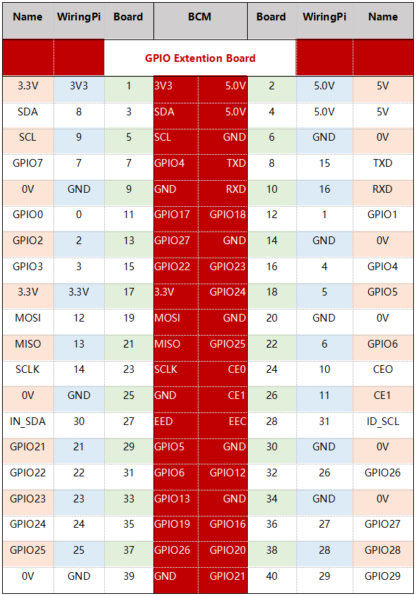

Raspberry Pi GPIO Extension Board
========================================

We apply the GPIO Extension Board to extend the pins of Raspberry Pi to
the breadboard and avoid damage caused by frequent plugging and
unplugging.

Here, we apply a 40-pin GPIO Extension board and a 40-pin GPIO cable. In
case of the potential risk of short circuit, you must build your circit in
strict accordance with the following picture.

.. image:: media/image82.png
    :align: center

The pins of Raspberry Pi have three kinds of ways to name and they are
wiringPi, BCM and Board. Among these naming methods, 40-pin GPIO
Extension board uses the naming method, BCM. But for some special
pins, such as I2C port and SPI port, they use the Name that comes with
themselves. The following table shows us the naming methods of
WiringPi, Board and the intrinsic Name of each pin on GPIO Extension
board. For example, for the GPIO17, the Board naming method of it is
11, the wiringPi naming method is 0, and the intrinsic naming method
of it is GPIO0.
 
.. Note::

    1）In C Language, what is used is the naming method WiringPi.
    
    2）In Python Language, the applied naming methods are Board and BCM,
    and the function GPIO.setmode() is used to set them.

