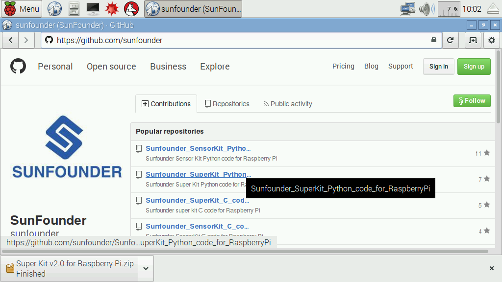
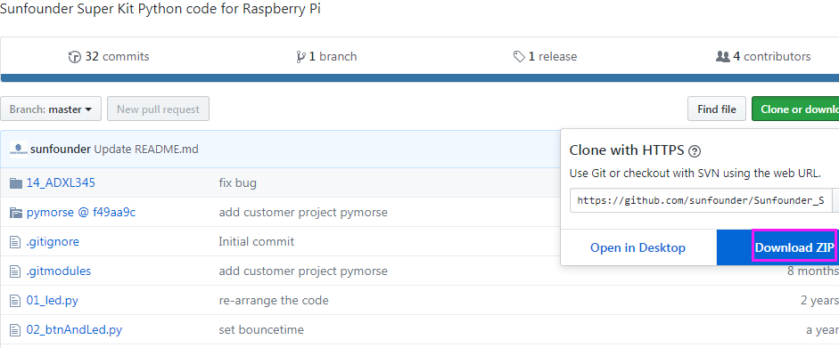

Download the Code
====================

Change directory to */home/pi*

.. code-block::

    cd/home/pi/

.. note:: 

    cd, short for change directory is to change to the intended
    directory from the current path. Informally, here is to go to the path
    */home/pi/*.

Clone the repository from GitHub (C code and python code)

.. code-block::

    git clone https://github.com/sunfounder/Sunfounder_SuperKit_C_code_for_RaspberryPi.git

.. code-block::

    git clone https://github.com/sunfounder/Sunfounder_SuperKit_Python_code_for_RaspberryPi.git

The advantage of this method is that, you can download the latest code
any time you want, and then place the code under the path */home/pi/*.
But in case of incorrect typing which is possible especially when you're
strange to the commands, you can just enter `github.com/sunfounder <https://github.com/sunfounder>`_ at the
address bar of a web browser, and on the page directed find the code for
Super Kit.

Click on the repository. On the page directed, click **Clone or
download** on the right side.

After download, transfer the package to */home/pi/*.

Now you can start the experiments. Let's rock!